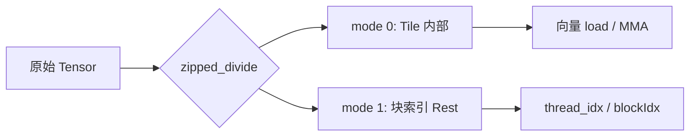

# `cute.zipped_divide`

对 Layout / Tensor 做「按块切分」，并把结果整理成 **两个顶层 mode** 的标准形状：

```text
((TileM, TileN, ...),  (RestM, RestN, ...))
  ── mode 0 ──            ── mode 1 ──
  一块 tile 内部           有多少块、块怎么排
```

本质是 [`logical_divide`](https://github.com/NVIDIA/cutlass/blob/main/media/docs/cpp/cute/02_layout_algebra.md) 之后 **zip**：把所有「子块内部」的 mode 收成 mode 0，把所有「块索引 / 剩余」收成 mode 1。

## 与其他 divide 的对比

```text
logical_divide : ((TileM, RestM), (TileN, RestN), ...)
zipped_divide  : ((TileM, TileN),  (RestM, RestN, ...))
tiled_divide   : ((TileM, TileN),  RestM, RestN, ...)
flat_divide    : (TileM, TileN, RestM, RestN, ...)
```

| API | 何时使用 |
|-----|----------|
| `zipped_divide` | 需要 **((Tile), (Rest))** 两 mode；线程/grid 管 Rest，块内算子在 Tile 上 |
| `logical_divide` | 需要保留「每个原始维各自的 Tile/Rest」层次 |
| `tiled_divide` | Rest 不想 zip 成一个 mode，而是 `(Tile, RestM, RestN, ...)` |
| `flat_divide` | 所有 mode 打平成一维，简单遍历 |

### 与 `logical_divide` 的差别

`logical_divide` 保留「每个原始维各自 (Tile, Rest)」的层次，例如 2D 切分后是 `((TileM, RestM), (TileN, RestN))`，按块取第 7 块、第 `(1,2)` 块较别扭。

`zipped_divide` 把问题变成 **二维逻辑**：

| mode | 语义 | 典型操作 |
|------|------|----------|
| 0 | **Tile 内部** | `gC[(None, coord)]` / `.load()` 取向量 |
| 1 | **块网格（Rest）** | `thread_idx` 映射到 `(mi, ni)`，或 `grid = size(..., mode=[1])` |

文档直觉：**横着走 mode 1 = 换一块 tile；竖着走 mode 0 = 块内元素**。

重要恒等式（CuTe 文档）：

> `layout<0>(zipped_divide(a, tiler)) == composition(a, tiler)`

即 mode 0 的布局就是「原张量与 tiler 复合」后的那块局部布局。

## 函数签名

```python
cute.zipped_divide(target: Layout | Tensor, tiler: Tiler) -> Layout | Tensor
```

- `target`：要切分的 layout 或 tensor
- `tiler`：块大小，可为 `Shape`、`Tile`（嵌套 tuple）或 `Layout`

若 `target` 形状为 `(s, t, r)`，`tiler` 为 `(BLK_A, BLK_B)`，则结果形状为：

```text
((BLK_A, BLK_B), (ceil_div(s, BLK_A), ceil_div(t, BLK_B), r))
```

参考：[CuTe DSL `zipped_divide` 文档](https://github.com/NVIDIA/cutlass/blob/main/python/CuTeDSL/cutlass/cute/core.py)、[Layout Algebra — Zipped Divide](https://github.com/NVIDIA/cutlass/blob/main/media/docs/cpp/cute/02_layout_algebra.md)。

## 示例：`element_wise/vectorize.py`

对 `(2048, 2048)` 的 `float16` 矩阵做行内向量化（每线程 8 个连续元素）：

```python
gC = cute.zipped_divide(mC, (1, 8))
# gC : ((1, 8), (2048, 256))
#       ↑ tile    ↑ rest（线程域）
```

- **mode 0 `(1, 8)`**：每个线程一次处理的向量块（同一行连续 8 个 `float16`）
- **mode 1 `(2048, 256)`**：在「块」粒度上的二维索引（2048 行 × 256 列块）

这不是拷贝数据，而是 **换了一种 layout 视角**。

### Host 侧：切分 + 启动配置

```python
threads_per_block = 256

gA = cute.zipped_divide(mA, (1, 8))
gB = cute.zipped_divide(mB, (1, 8))
gC = cute.zipped_divide(mC, (1, 8))

vectorized_elementwise_add_kernel(gA, gB, gC).launch(
    grid=(cute.size(gC, mode=[1]) // threads_per_block, 1, 1),
    block=(threads_per_block, 1, 1),
)
```

#### `grid` 与 `cute.size(gC, mode=[1])`

`grid` 的 x 维 = **mode 1 上的工作块总数** ÷ **每 block 线程数**。

| 部分 | 含义 |
|------|------|
| `cute.size(gC, mode=[1])` | 张量第 1 号 mode 上的工作项总数（此处为 `2048 × 256 = 524_288`） |
| `// threads_per_block` | 每个 block 256 线程 → 需要的 block 数 |
| `block=(256, 1, 1)` | 每 block 256 线程 |

总逻辑线程数：

```text
grid.x × block.x = size(gC, mode=[1])
```

与 kernel 内 `thread_idx = bidx * 256 + tidx` 的范围一致。

与朴素版 `grid = (m * n) // 256` 对比（`2048×2048`）：

| 版本 | 每线程工作量 | 逻辑工作项 | grid.x |
|------|-------------|-----------|--------|
| naive | 1 元素 | `M×N` | `16384` |
| vectorize | 8 元素 | `M×(N/8)` | `2048` |

`16384 / 2048 = 8`：向量化后 block 数少 8 倍，总标量覆盖量相同。

**隐含前提**：`size(gC, mode=[1]) % 256 == 0`。否则末尾块会没有线程处理，需向上取整或 padding。

### Device 侧：mode 1 映射线程，mode 0 做向量

```python
m, n = gA.shape[1]           # mode 1 的形状
ni = thread_idx % n
mi = thread_idx // n

a_val = gA[(None, (mi, ni))].load()   # None 保留 mode 0，向量加载
gC[(None, (mi, ni))] = a_val + b_val
```

- `(mi, ni)`：在 **块网格（mode 1）** 上选一块
- `None`：保留整个 **mode 0**，得到 `(1, 8)` 子张量

## 使用场景

### 1. 向量化 load/store

```python
gC = cute.zipped_divide(mC, (1, 8))
gC[(None, (mi, ni))] = ...   # 在 8 元素上向量运算
```

Ampere 上 128-bit 访存、`float16` 一次 8 元素，用 `(1, 8)` tiler 把「标量元素域」变成「向量块域」。

### 2. Thread-block / CTA 级 tiling（GEMM 等）

```cpp
Tensor gmem_tiled = zipped_divide(gmem, cta_tiler);  // ((TileM,TileN), Rest...)
Tensor cta_tile = gmem_tiled(_, blockIdx_coord);     // 每个 block 一块
```

把全局张量划成 `(TileM, TileN)` 的块，block 索引 mode 1，块内再做 MMA / shared memory。

### 3. Thread × Value（TV）划分

先 `zipped_divide` 得到 `((Tile), (Rest))`，再配合 `make_layout_tv`：mode 1 给 **grid**，mode 0 + TV layout 给 **block 内线程与向量元素** 的映射。

### 4. 与 `local_tile` / `inner_partition`

```python
tile = cute.local_tile(mC, (1, 8), (mi, ni))
```

逻辑上等价于：先 divide，再按坐标取 mode 1 上的一块。`zipped_divide` 常在 host / jit 侧一次性建好「已分块」的 `gTensor`，kernel 里只做 slice。

## 选 `tiler` 的原则

| 目标 | tiler 示例 |
|------|------------|
| 行内向量化 8 元素 | `(1, 8)` |
| 2D thread-block tile | `(128, 64)` 等 |
| 与 MMA atom 对齐 | 与 `TiledMma` / copy atom 的 tile shape 一致 |

注意：

- `tiler` 的 rank 不能超过 `target` 的 rank
- 向量访存需满足对齐（如 `from_dlpack(..., assumed_align=16)` + `float16` × 8 = 128 bit）

## 数据流示意



## 小结

`zipped_divide(mC, (1, 8))` 把矩阵逻辑上重排成 **「(每块 1×8 向量) × (块在 M×N/8 网格上的索引)」**：

1. **mode 1** 直接对接 CUDA grid / `thread_idx`
2. **mode 0** 对接向量化 `.load()` / store

这是 elementwise 向量化、GEMM CTA tiling、TV layout 等 CuTe kernel 里「先分块、再按 mode 切片」的标准入口。

## 延伸阅读

- [CuTe Tensor — Tiling a Tensor](https://github.com/NVIDIA/cutlass/blob/main/media/docs/cpp/cute/03_tensor.md)
- [CUTLASS `elementwise_add.ipynb`](https://github.com/NVIDIA/cutlass/blob/main/examples/python/CuTeDSL/cute/notebooks/elementwise_add.ipynb) — Vectorized Load and Store 章节
- 本仓库示例：[`element_wise/vectorize.py`](../../element_wise/vectorize.py)、对比 [`element_wise/navive.py`](../../element_wise/navive.py)

---

## 编程方式的好处：与 naive / 传统 CUDA 对比

`zipped_divide` 的核心是把 **「怎么切数据」** 从 kernel 里的手工算术里抽出来，变成 **Layout 上的一次声明**；kernel 只负责 **在哪个 mode 上认领工作、在哪个 mode 上做向量运算**。

### 两种写法在做什么

#### naive / 传统：按「标量元素」思考

[`navive.py`](../../element_wise/navive.py) 中：

```python
m, n = gA.shape
ni = thread_idx % n
mi = thread_idx // n
a_val = gA[mi, ni]
gC[mi, ni] = a_val + b_val
```

- 张量形状 `(M, N)`，一线程一元素
- `grid` 按 `M×N` 计算
- 要向量化需自行处理：指针、`float4`/`uint4`、对齐、`col * 8` 等

传统 CUDA 大致等价于：

```cuda
int i = blockIdx.x * blockDim.x + threadIdx.x;
if (i < M * N) {
    int row = i / N, col = i % N;
    C[row * N + col] = A[...] + B[...];  // 标量
}
// 向量化则要另写 index / reinterpret / 边界
```

#### vectorize + `zipped_divide`：按「向量块」思考

[`vectorize.py`](../../element_wise/vectorize.py) 中 Host：

```python
gA = cute.zipped_divide(mA, (1, 8))
```

Kernel：

```python
m, n = gA.shape[1]
a_val = gA[(None, (mi, ni))].load()
gC[(None, (mi, ni))] = a_val + b_val
```

- 张量变为 `((1,8), (M, N/8))`：**mode 0 = 块内 8 元素，mode 1 = 线程网格**
- Host 声明 `(1, 8)` 一次；kernel 用统一的 `(None, (mi, ni))` + `.load()`
- `grid` 来自 `size(gC, mode=[1])`，与 layout 自动一致

### 主要好处

#### 1. 声明式切分，而非 kernel 内堆索引公式

| | 传统 | `zipped_divide` |
|---|------|-----------------|
| 切分意图 | 散落在 `row/col`、`*8`、`vec_idx` | Host 一行 `(1, 8)` |
| 线程域 | 手算 `M×N` 或 `M×(N/8)` | `gA.shape[1]` / `size(..., mode=[1])` |
| 向量访存 | 自行保证连续、对齐 | mode 0 由 layout 保证，`.load()` 生成向量指令 |

改 tiler（如 `(1,4)` → `(1,8)`）时，多数情况 **只改 host 的 tiler**，kernel 仍为 `(None, (mi, ni))`。

#### 2. 职责分离清晰

```text
Host (jit)  : zipped_divide → 定义「块有多大、有多少块」
Launch      : size(mode=[1]) → 块数 ↔ grid
Kernel      : thread_idx → (mi,ni)；None → 块内向量算子
```

传统写法中三层常缠在一起：同一 `i` 既要 2D 映射，又要向量偏移，还要考虑 coalescing。

#### 3. Layout 负责「逻辑坐标 → 物理地址」

向量化后的 8 宽维度编进 layout，而不是手写：

```cuda
half* ptr = &A[row * stride + col * 8];
```

CuTe 知道这是 `(1,8)` 子张量，`.load()` 可走 128-bit 访存。

#### 4. 与 launch 配置天然对齐

```python
grid=(cute.size(gC, mode=[1]) // threads_per_block, 1, 1)
```

避免「kernel 按向量块写、grid 仍按标量 launch」的不同步。传统代码里 `grid` 与 kernel 索引公式须人工保持一致。

#### 5. 可组合、可扩展

同一接口可过渡到 CTA tile、TV layout、GEMM gmem 分块等。传统 CUDA 每升一级优化常 **重写 kernel**；CuTe 多是 **换 tiler / 换 slice**。

#### 6. 非平凡 layout 时更不易写错

padding、swizzle、非连续 stride 时，传统写法要改多处 `row * lda + col`；CuTe 改 layout/tiler，slice 模式可保持不变。

### 直观对照

```text
传统 CUDA:
  全局线性 i → 自算 (row,col) / vec_id → 自算指针与对齐 → 自算 grid

CuTe + zipped_divide:
  Host: zipped_divide(tensor, tiler)
  Launch: size(tensor, mode=[1])
  Kernel: (mi,ni)=f(thread_idx); tensor[(None,(mi,ni))].load()
```

**naive → vectorize** 在 kernel 里主要变化：

- `gA.shape` → `gA.shape[1]`
- `gA[mi, ni]` → `gA[(None, (mi, ni))].load()`

最大增量在 host 三行 `zipped_divide`，而非 kernel 内重写 8 元一组索引。

### 代价与适用场景

| 代价 | 说明 |
|------|------|
| 学习成本 | 需理解 mode 0/1、`None` slice、layout 打印 |
| 极简 kernel | 单次标量 `a[i]+b[i]` 时，裸 CUDA / Triton 可能更短 |
| 调试 | layout 输出较抽象 |

**适合**：向量化、分块、非平凡 layout、后续叠 GEMM / 更复杂 tiling。

**一句话**：在 layout 层声明「每线程干多大一块、共多少块」，kernel 用统一 slice + `load/store`，避免传统写法里索引、向量宽度、grid 三套公式各写各的、容易不同步。

### 附：`threads_per_block` 与 kernel 映射

修改 `threads_per_block`（如 256 → 512）时：

- **只需改 host** 的 `threads_per_block` 及 `launch` 的 `grid`/`block`（已用变量则自动联动）
- **kernel 第 13–22 行不必改**：`bdim = cute.arch.block_dim()` 为运行时值，`m,n = gA.shape[1]` 与 block 大小无关

前提：

- `size(gC, mode=[1]) % threads_per_block == 0`
- 每 block ≤ 1024 线程（常见 GPU 上限）
- 建议为 32 的倍数（warp 对齐）
