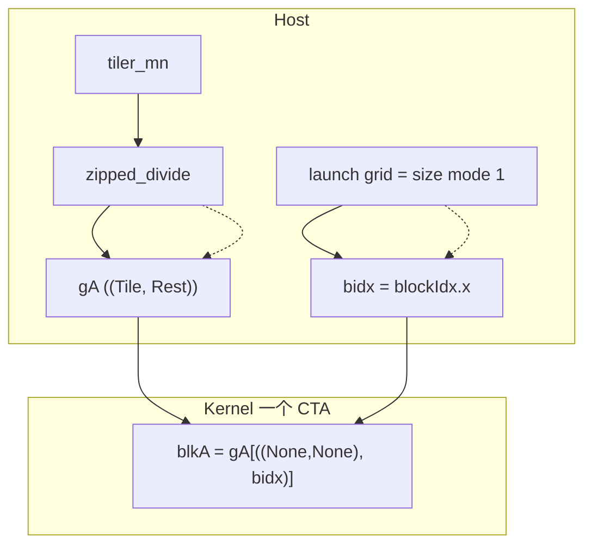

# `blk_coord` 与 CTA tile 选择

本文说明 [`element_wise/tv_layout.py`](../element_wise/tv_layout.py) 中 CTA 级 slice 的原理：

```python
blk_coord = ((None, None), bidx)
blkA = gA[blk_coord]  # (TileM, TileN) -> physical address
```

---

## 核心原理

**Host 先把全局张量改写成「tile 内容 × tile 编号」两层坐标；`bidx` 与 launch 的 grid 对齐，在第二层上取第 `bidx` 号，第一层用 `None` 保留整块 tile。**

`gA[blk_coord]` 不是手算字节偏移，而是 **layout 代数上的 slice**：固定「砖块编号」这一维，保留「砖内坐标」这一维。

---

## 1. 抽象模型：先「分箱」，再「选箱」

把全局数据看成许多相同大小的 **逻辑砖块（tile）**，排成 **砖块网格（Rest）**：

```text
全局张量  ≅  一块砖的形状 (TileM, TileN)  ×  砖在网格上的编号 (Rest…)
              ───── mode 0 ─────              ───── mode 1 ─────
```

Host 上的 `zipped_divide(mA, tiler_mn)` 做这次 **重排视角**（通常不搬数据）：每个全局逻辑坐标写成「在这块砖里的哪里」+「这是第几块砖」。

Kernel 里：

```python
blk_coord = ((None, None), bidx)   # 砖内全要，砖号 = bidx
blkA = gA[blk_coord]
```

| 坐标部分 | 含义 |
|----------|------|
| `(None, None)` | mode 0：这块砖内部 **全部** 坐标保留 → 子张量形状仍是 `(TileM, TileN)` |
| `bidx` | mode 1：在「砖块网格」上取 **第 bidx 号** 那一块 |

**`bidx` 能选中 CTA 的 tile**，是因为 **gA 的第二 mode 本来就是「tile 索引」**，而 CUDA 的 `blockIdx.x` 与 launch 的 grid 一一对应这个索引。

---

## 2. 为什么 `bidx` 会对得上「第几块砖」

Launch 时（host）：

```python
grid = [cute.size(gC, mode=[1]), 1, 1]   # tile 块的总数
block = [cute.size(tv_layout, mode=[0]), 1, 1]  # 例如 256
```

约定：

```text
blockIdx.x == bidx  ∈  [0, num_tiles)
```

每个 CTA 拿到不同的 `bidx` → 在 mode 1 上指向不同 tile → 各管全局的一块 `(TileM, TileN)`，合起来覆盖整个矩阵（在整除、无边界问题时）。

这是 **CUDA 网格索引** 与 **CuTe layout 第二 mode** 的 deliberate 对齐，不是 `bidx` 里藏了额外公式。

---

## 3. `gA[blk_coord]` 在做什么

张量在 CuTe 里是 **(layout, pointer)**：layout 把 **逻辑坐标 → 偏移**。

Slice `gA[coord]` 时：

1. 用 `coord` 在 layout 上 **固定** 某些 mode（这里固定 mode 1 = `bidx`）
2. **去掉** 被固定的 mode，剩下 mode 0 的 layout → 子张量 `blkA`
3. pointer 加上该 tile 的 **基址偏移**（由 layout 算出）

因此 `blkA` 的含义是：

```text
blkA : (TileM, TileN) → 物理地址
```

仍是「逻辑坐标 → 地址」，只是逻辑域从「全球」缩成「本 CTA 这一块砖」。

---

## 4. 要做到「bidx 选 CTA tile」需要准备什么

| 步骤 | 做什么 | 作用 |
|------|--------|------|
| **① 定砖大小** | `tiler_mn`（如 `thr×val` → `(64, 512)`） | 定义一块 tile 的逻辑形状 |
| **② 分箱** | `gA = cute.zipped_divide(mA, tiler_mn)` | 全局 → `((TileM, TileN), Rest)` 两层坐标 |
| **③ 对齐 grid** | `grid.x = size(gA, mode=[1])` | 一块砖一个 block；`bidx` 即 tile 下标 |
| **④ Kernel slice** | `gA[((None, None), bidx)]` | 用 `bidx` 在 mode 1 上取砖 |

缺任何一环都会对不上：

- 没有 **②**：没有「tile 编号」这一维，`bidx` 无处落脚
- 没有 **③**：`bidx` 范围与 tile 个数不一致 → 漏算或越界
- `tiler_mn` 与 `tv_layout` 不一致 → 砖的大小和块内线程划分矛盾

---

## 5. 数据流（Host → Device）

```text
        Host                          Device（一个 CTA）
         │                                  │
  tiler_mn 定义砖大小                      │
         │                                  │
  zipped_divide ──► gA((Tile, Rest))        │
         │                                  │
  launch grid = |Rest|                     bidx = blockIdx.x
         │                                  │
         └──────────────────────────────────┤
                                            ▼
                              blkA = gA[ (全 Tile, bidx) ]
                                            │
                              本 CTA 只看见一块 (TileM, TileN)
```



---

## 6. 与 `thr_layout`、`val_layout`、`tv_layout` 的关系

它们 **不出现在 `blk_coord` 这几行**，但 **间接决定 `blkA` 有多大**，并在后续步骤分工：

```text
thr_layout + val_layout
       ↓ make_layout_tv
  tiler_mn ──────────→ zipped_divide → gA((Tile, Rest))   ← blk_coord 用这层
  tv_layout ─────────→ composition(blkA, tv_layout)       ← 块内 tidx/vid
```

```text
TileM = thr_M × val_M   # 例如 4 × 16 = 64
TileN = thr_N × val_N   # 例如 64 × 8 = 512
```

| 层级 | 代码 | 谁决定 | 回答的问题 |
|------|------|--------|------------|
| **CTA** | `blk_coord` + `blkA` | `tiler_mn` | **哪个 block** 管 **哪一块 (64×512) tile** |
| **块内 TV** | `composition(blkA, tv_layout)` | `tv_layout`（thr+val） | 块内 `(tidx, vid)` → 地址 |
| **单线程** | `(tidx, None)` → `thrA` | `val_layout` 等 | **当前线程** 的 value 子张量 |

记忆：

```text
bidx     → 哪一间「大房间」(CTA tile)
tidx/vid → 大房间里哪个线程、处理哪几段数据
tv_layout → (tidx, vid) 到坐标的规则
```

**`blk_coord` 只负责 CTA 选砖；`tv_layout` 不负责选砖，只在已选中的砖内做线程/value 映射。**

---

## 7. 三层划分总览

```text
全局 mA (M×N)
    │
    │  Host: zipped_divide(mA, tiler_mn)
    ▼
gA : ((TileM, TileN), Rest)
    │
    │  ① blk_coord = ((None, None), bidx)
    ▼
blkA : (64, 512)               ← 本 block 的 tile
    │
    │  ② composition(blkA, tv_layout)
    ▼
tidfrgA : (tidx, vid) → 地址
    │
    │  ③ (tidx, None)
    ▼
thrA : (vid) → 地址            ← 当前线程
```

---

## 8. 与 `vectorize.py` 的对比

| | `vectorize.py` | `tv_layout.py`（blk_coord） |
|---|----------------|----------------------------|
| 切分 | `(1, 8)` 向量块 | CTA tile `(64, 512)` |
| block 选数据 | 无单独 CTA tile 层；`thread_idx` 直接映全局 | 先 `bidx` 选 tile，再 `tidx`+`vid` |
| 层次 | 一层（线程≈全局工作项） | 至少两层（block → thread） |

---

## 9. 常见理解纠正

| 说法 | 更准确 |
|------|--------|
| `tv_layout` 和 `bidx` 一起选 tile | **tile 由 `bidx` + slice 选好**；`tv_layout` 只在 tile **内部** 映射 |
| `blkA` 是拷贝了一块内存 | 通常是 **同一底层存储 + 新 layout 视角**（子张量） |
| 任意 `bidx` 都行 | 需要 host `grid` 与 `size(gA, mode=[1])` 一致 |

---

## 10. 一句话

**`bidx` 能选中 CTA 的 tile**，是因为 Host 用 `zipped_divide` 把张量写成 **「tile 内坐标 + tile 编号」**，Launch 让每个 block 的 `bidx` 对应一个 tile 编号，`gA[((None, None), bidx)]` 在 layout 上 **固定编号、保留砖内全貌**。

你要做的是：**定 `tiler_mn` → `zipped_divide` → `grid` 与 `size(mode=1)` 一致 → kernel 用 `bidx` 在第二 mode 上 slice**。

---

## 延伸阅读

- [`docs/api/zipped_divide.md`](api/zipped_divide.md) — `zipped_divide` 与 mode 0/1
- [`element_wise/tv_layout.py`](../element_wise/tv_layout.py) — 完整 TV kernel 示例
- [CuTe Tensor — Tiling & Partitioning](https://github.com/NVIDIA/cutlass/blob/main/media/docs/cpp/cute/03_tensor.md)
