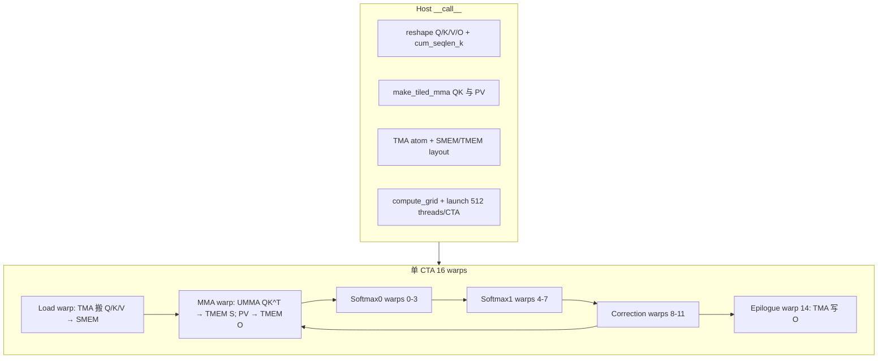

# FMHA：Blackwell 融合多头注意力

以 `fmha/fmha.py` 与 `fmha/fmha_helpers.py` 为例。这是 CUTLASS CuTeDSL 在 **SM100 (Blackwell)** 上的 **融合多头注意力（FMHA）** 实现：在 **单个 kernel** 内完成 \(QK^\top\)、softmax（含 mask）、\(PV\)，避免将整块 attention map 写回 GMEM。

相关文档：[dense_gemm.md](gemm/dense_gemm.md)、[pipeline.md](pipeline.md)。工程侧 AOT/Thor 部署可参考 `TensorRT-Edge-LLM/kernelSrcs/fmha_cutedsl_blackwell/README.md`。

---

## 1. 功能概览

### 1.1 计算问题

\[
O = \mathrm{softmax}\left(\frac{Q K^\top}{\sqrt{d}} \cdot s_q s_k\right) V
\]

（可选 causal / sliding window mask、FP8 per-tensor scale 等。）

与 `dense_gemm` 的 batched GEMM 不同：中间 **不把整块 \(S_q \times S_k\) 写回 GMEM**；分数矩阵主要在 **TMEM**，经 softmax / correction warp 在线更新，再算 \(P V\)（FlashAttention 类 **分块融合**）。

### 1.2 核心类

`BlackwellFusedMultiHeadAttentionForward`：Host `__call__` 负责 layout 变换、TMA/MMA 配置、grid 与 launch；Device `kernel` 为 **warp 专精** 的持久/非持久调度实现。

### 1.3 与 dense_gemm 的定位对比

| | dense_gemm | fmha |
|--|------------|------|
| 算子 | 独立 batched GEMM | **QKᵀ + softmax + PV 融合** |
| batch | 任意 GEMM batch 维 L | **Attention 语义**（B, S, H, D + KV cache） |
| Thor | 数据中心 SM100 示例为主 | **TRT 工程明确支持 sm_110 AOT** |
| 能否拼成 MHA | 只能当子模块 | **本身就是 MHA** |

---

## 2. 张量形状与 API

### 2.1 CLI / `run_fmha` 形状

| 参数 | 形状 | 含义 |
|------|------|------|
| `q_shape` | `(B, S_q, H_q, D)` | Query |
| `k_shape` | `(B, S_k, H_k, D)` | 逻辑 K；运行时建成 **KV cache** |

`__call__` 运行时实际使用：

| 张量 | 形状 | 说明 |
|------|------|------|
| Q / O | `(B, S_q, H_q, D)` | 动态 B、S_q、H_q；D 编译期静态 |
| KV cache | `(B, 2, H_kv, cap, D)` | `cap` = `k_shape[1]`，**物理容量** |
| `cum_seqlen_k` | `(B+1,)` | 每 batch **有效 KV 长度** |

GQA：`h_r = H_q // H_k`，内部 layout 将 head 展开为 `((h_r, H_k), B)`。

### 2.2 `q_shape` / `k_shape` 硬性约束（`run_fmha`）

| 约束 | 说明 |
|------|------|
| `B` 相同 | q 与 k batch 一致 |
| `D` 相同 | head 维一致 |
| `H_q % H_k == 0` | 支持 GQA/MQA |
| `in_dtype` / `out_dtype` | `Float16` 或 `Float8E4M3FN` |
| `qk_acc_dtype` / `pv_acc_dtype` | 必须 **Float32** |
| `mma_tiler_mn` | 文件头要求 **(128, 128)** |
| 变长 nested `S_q`/`S_k` tuple | **未实现**（`NotImplementedError`） |

**Head 维 D**：

- 文档示例：32 / 64 / 128；严格 `{32,64,128}` 检查在代码中已注释。
- FP16：MMA K 向上 **pad 到 16 的倍数**（如 72→80）；`actual_head_dim` 保留真实 D，TMA ZFILL / OOB 处理多余列。
- TensorRT 预编译 variant：**LLM 正式 d64、d128**；ViT 另有 d72、d80 等。

### 2.3 Mask 与模式

| 模式 | 行为 |
|------|------|
| `--is_causal` | `window_size_right = 0` |
| `--window_size L,R` | 滑动窗口；若某 query 行无有效 K → `ValueError`（防 softmax NaN） |
| `--bottom_right_align` | LLM chunked prefill 对齐（`WINDOW_MASK_INFERENCE`） |
| `--vit_mode` | 要求 `k_shape == q_shape`；双向、无 causal |

---

## 3. 端到端流程



**数据通路（抽象）：**

```
GMEM(Q,K,V) ──TMA──► SMEM(sQ/sK/sV)
                        │
                        ▼ UMMA (tcgen05)
                     TMEM(S 分数, O 累加, P)
                        │
        Softmax0/1 + Correction (online softmax)
                        │
                        ▼ Epilogue
                     GMEM(O)
```

---

## 4. Warp 专精与固定资源

### 4.1 CTA 内 warp 分工（512 线程）

| Warp ID | 角色 |
|---------|------|
| 0–3 | Softmax0 |
| 4–7 | Softmax1 |
| 8–11 | Correction |
| 12 | MMA（QKᵀ、PV） |
| 13 | Load（TMA） |
| 14 | Epilogue |
| 15 | Empty（barrier 初始化等） |

### 4.2 与 tile / 形状绑定的常量

| 项 | 值 | 说明 |
|----|-----|------|
| `cta_tiler` | `(256, 128, D_pad)` | M = 2×128：每 tile **256 query × 128 key** |
| `qk_mma_tiler` | `(128, 128, D_pad)` | QKᵀ MMA |
| `pv_mma_tiler` | `(128, D_pad, 128)` | PV MMA（N/K 维对调） |
| `cluster_shape_mn` | `(1, 1)` | 无 dense_gemm 式 2CTA cluster |
| Pipeline stage | Q:2, KV:3(FP16)/4(FP8), 多条 mbar | **SMEM 占用固定**，不随 S_q 增大而增 stage |
| TMEM | `get_max_tmem_alloc_cols("sm_100")` + 固定 offset | S0/S1/O0/O1/P 等 ping-pong |

**沿 K（序列）维**：Load/MMA 循环按 K tile 推进，配合 **online softmax**（S0/S1 乒乓 + correction），不 materialize 全长 \(S_q \times S_k\)。

### 4.3 Grid 调度（`fmha_helpers.compute_grid`）

内部 O 的 logical shape：`(s, d, ((h_r, h_k), b))`。

| 模式 | Grid |
|------|------|
| 非 persistent | `ceil(S_q / 256) × h_r × B` |
| persistent | `min(SM 数, num_m_blocks × h_r × B)` |

`FmhaStaticTileScheduler` 对越界 query tile 可 skip（`check_valid_work_for_seqlen_q`）。

---

## 5. Pipeline 与 Kernel 阶段

Host `_setup_attributes` 固定 stage 数（非按问题规模动态算）：

| Stage | 数量 |
|-------|------|
| `q_stage` | 2 |
| `kv_stage` | 3（FP16）/ 4（FP8） |
| `mma_softmax_stage` | 1 |
| `mma_corr_stage` | 2 |
| `softmax_corr_stage` | 1 |
| `epi_stage` | 2 |

Device `kernel` 主要 pipeline：

- `PipelineTmaUmma`：Load Q / Load KV
- `PipelineUmmaAsync`：MMA ↔ Softmax
- `PipelineAsync`：Softmax ↔ Correction、Correction ↔ Epilogue
- TMEM 分配与 `tmem_dealloc_mbar` 协调多 warp 释放

---

## 6. 对 `q_shape` / `k_shape` 的资源与规模理解

**没有**类似 `dense_gemm._compute_stages` 那样按 MNK 动态改 stage；主要限制如下。

### 6.1 Tile 与序列

- `S_q` **不必**是 256 的倍数，但不对齐会影响效率。
- `k_shape[1]` = KV cache **容量 `cap`**；有效长度由 `cum_seqlen_k` 决定，需 **`有效_K_len ≤ cap`**。
- 多轮 prefill：`num_rounds * seq_len ≤ cap`（见 `llm_prefill_test`）。

### 6.2 Head 与 GQA

- 建议 **D = 64 或 128**（与 TRT 预编译 variant 一致）。
- `H_q`、`H_k` 增大 → grid 在 head/batch 维变多，**不增加单 CTA SMEM**。
- GQA 例：`H_q=14, H_k=1` → `h_r=14`。

### 6.3 SMEM / TMEM

- 由 **固定 stage + 128×128 tile + D_pad** 决定；`S_q`、`S_k` 很大时主要是 **更多 CTA / 更长运行时间**，而非单 CTA 按序列扩容 SMEM。
- 编译/launch 失败多见于：**D/tiler/dtype 组合不支持**、arch 表缺失、SMEM 总超限（少见）。

### 6.4 Sliding window

窗口配置不当 → 某行无有效 K → `run_fmha` 中 `check_seqlen_valid` 报错。

---

## 7. 运行与校验

### 7.1 示例命令（LLM）

```bash
# 小规模正确性
python fmha/fmha.py \
  --q_shape 1,256,8,64 \
  --k_shape 1,256,1,64 \
  --is_causal --is_persistent --bottom_right_align \
  --mma_tiler_mn 128,128

# 接近 TRT 插件：GQA + d128
python fmha/fmha.py \
  --q_shape 1,1024,14,128 \
  --k_shape 1,1024,1,128 \
  --is_causal --is_persistent --bottom_right_align
```

### 7.2 ViT

```bash
python fmha/fmha.py \
  --q_shape 1,1024,14,64 \
  --k_shape 1,1024,14,64 \
  --is_persistent --vit_mode
```

### 7.3 参考校验

默认与 **NumPy/PyTorch 风格参考**（`einsum` + softmax + mask）对比；`--skip_ref_check` 可跳过。`--export_only` 用于 AOT 导出，跳过校验与 benchmark。

---

## 8. Jetson Thor（sm_110）

### 8.1 工程支持

`TensorRT-Edge-LLM` 的 FMHA README 写明：

- 编译需在 **Blackwell 或 Thor（SM100 / SM110）** 上执行 `build_cutedsl.py`。
- 例：`python kernelSrcs/build_cutedsl.py --kernels fmha --gpu_arch sm_110`
- Thor 部署：`EMBEDDED_TARGET=auto-thor` + 预生成 `sm_110` 的 AOT 库。

**Thor 可走这条 FMHA 路径**（与仅 SM100 数据中心的 `dense_gemm` 教程不同）。

### 8.2 源码注意点

| 风险 | 说明 |
|------|------|
| CUTLASS DSL | 建议 **≥ 4.4.1**；旧包可能缺 `sm_110` 的 SMEM/arch 映射 |
| `get_max_tmem_alloc_cols("sm_100")` | 写死 **sm_100**；需确认 Thor 上 TMEM 列数是否与 100 一致，或按设备 arch 查询 |
| Python 直跑 vs AOT | Thor 本机可 `python fmha.py`；交叉编译部署只需链接 `.o`，不需 Thor 上跑 Python |
| 勿混用 | 不要用 `blackwell_geforce` 的 `Sm120GemmKernel` 替代此 FMHA |

### 8.3 Thor 上 shape 建议

| 场景 | 建议 |
|------|------|
| 学习/调试 | `B=1`, `S_q=S_k=256~1024`, `H_q=H_k=8` 或 GQA `H_k=1`, `D=64` |
| 对齐 TRT LLM | `D∈{64,128}`, `k_shape[1]` = KV **capacity** ≥ 实际序列长 |
| 长上下文 | 增大 cap；`--is_persistent`；编译时 `-j 1` 省 GPU 显存 |
| ViT | `--vit_mode`，`q_shape==k_shape`，D 对应 d64/d72/d80/d128 variant |

### 8.4 TRT 预编译 variant（参考）

| Variant | Head Dim | SWA | 模式 |
|---------|----------|-----|------|
| `fmha_d64` | 64 | No | LLM causal |
| `fmha_d128` | 128 | No | LLM causal |
| `fmha_d64_sw` / `fmha_d128_sw` | 64/128 | Yes | LLM + sliding window |
| `vit_fmha_d64` 等 | 64/72/80/128 | No | ViT 双向 |

LLM 使用 KV layout `[B, 2, H_kv, S_k, D]`；ViT 使用 packed Q/K/V + `cu_seqlens`。

---

## 9. 源码文件

| 文件 | 说明 |
|------|------|
| `fmha/fmha.py` | `BlackwellFusedMultiHeadAttentionForward`、kernel、`run_fmha`、CLI |
| `fmha/fmha_helpers.py` | `FmhaStaticTileScheduler`、`compute_grid`、`FusedMask` |
| `hello_cutedsl/fmha.py` | CUTLASS 上游示例（较简） |
| `TensorRT-Edge-LLM/.../fmha_cutedsl_blackwell/` | AOT、Thor 部署、patch 说明 |

上游来源：CUTLASS `examples/python/CuTeDSL/blackwell/fmha.py`（SM100 tcgen05 + TMEM + warp 专精）。

---

## 10. 一句话总结

**`fmha.py`** 在 Blackwell 上用 **TMA + tcgen05 UMMA + TMEM + 多 warp 流水** 实现 **融合 FMHA**；`q_shape`/`k_shape` 受 **B、GQA、D 对齐、mma 128×128、KV cap、mask** 约束，单 CTA 资源基本固定，序列变长靠 **更多 tile/block**。**Jetson Thor** 应使用 **sm_110 AOT/本机编译**，形状优先 **D=64/128** 与合理的 **KV capacity**。
