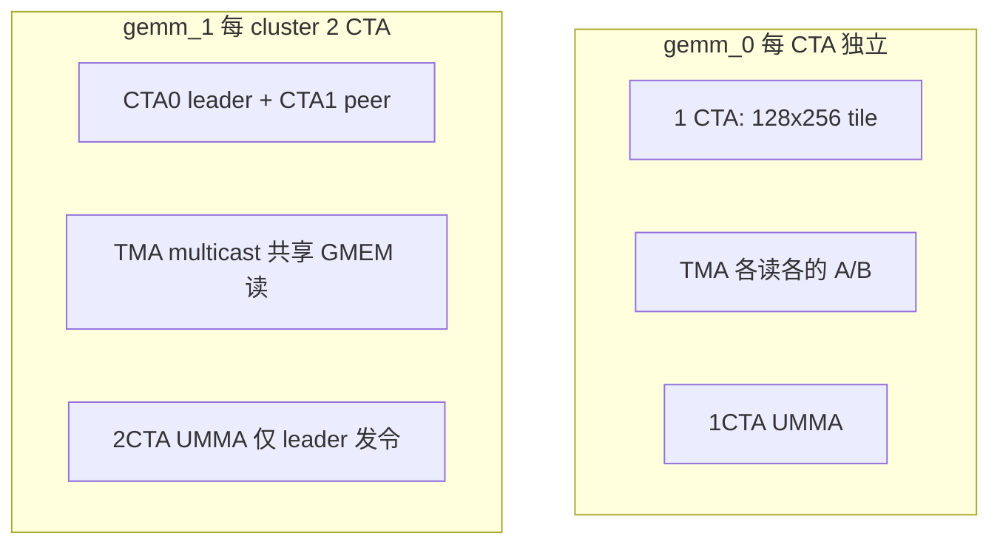

# fp16_gemm_0 vs fp16_gemm_1 对比与理论性能分析

对比 `gemm/fp16_gemm_0.py` 与 `gemm/fp16_gemm_1.py` 的实现差异及理论性能（基于源码与官方注释，非特定机器实测）。

相关文档：[fp16_gemm_1.md](fp16_gemm_1.md)、[pipeline.md](../pipeline.md)、[smem.md](../smem.md)。

---

## 1. 核心配置对比

| 维度 | fp16_gemm_0 | fp16_gemm_1 |
|------|-------------|-------------|
| MMA | 1CTA (`CtaGroup.ONE`) | **2CTA** (`CtaGroup.TWO`) |
| Cluster | 无 | **`(2, 1, 1)`** |
| CTA 输出 tile (M×N) | **128×256** | **256×256**（2 CTA 合力） |
| MMA 指令块 | (128, 256, 16) | **(256, 256, 16)** |
| K tile | 64 | 64 |
| `ab_stages` | **4** | **7** |
| TMA | 普通 G2S | **Multicast G2S** |
| 主循环 UMMA | warp 0 | warp 0，**仅 leader CTA** |
| `prefetch_stages` | `ab_stages-2` = **2** | **5** |
| M/N 整除约束 | M%128, N%256 | **M%256, N%256** |

**相同点**：FP16 输入、FP32 累加、TMEM 累加器、TMA→SMEM→UMMA→TMEM→Epilogue 流水线骨架、128 线程/CTA、`acc_stage=1`。

---

## 2. 架构与代码差异



| 机制 | gemm_0 | gemm_1 |
|------|--------|--------|
| **算力组织** | 1 SM ≈ 1 个独立 128×256 子问题 | 2 SM **绑成 cluster**，合算 256×256 |
| **GMEM 读 A/B** | 每个 CTA 各读一份 | **Multicast**：同行/同列 CTA **共享** 一次 L2/DRAM 读 |
| **SMEM** | A 16KB + B **32KB** / stage | A 16KB + B **16KB** / CTA / stage |
| **流水深度** | 4 stage | **7 stage** |
| **Epilogue 收尾** | 较简单 | `ab/acc producer.tail()`、2CTA `tmem_dealloc_mbar` |

---

## 3. SMEM 与延迟隐藏（理论上的第一大差异）

文件头给出的单 stage 体量（FP16）：

| | A / stage | B / stage | A+B / CTA |
|--|-----------|-----------|-----------|
| gemm_0 | 128×64×2 = **16 KB** | 256×64×2 = **32 KB** | **48 KB** |
| gemm_1（per CTA） | 16 KB | **16 KB**（B 减半） | **32 KB** |

在 ~227 KB/SM SMEM 预算下（`fp16_gemm_1.py` 注释估算）：

- gemm_0：`227 / 48 ≈ 4` stage → **512×(4−1) ≈ 1.5K cycles** 量级的可隐藏延迟窗口
- gemm_1：`227 / 32 ≈ 7` stage → **512×(7−1) ≈ 3K cycles**

**结论（内存延迟主导时）**：gemm_1 用 **更浅的 per-CTA B buffer** 换 **更深 AB 流水线**，`prefetch_stages` 从 2 提到 5，**更有利于盖住 DRAM/L2 延迟**。这是官方称 gemm_0 在高 SM 频率下 DRAM latency 更伤、gemm_1 往往更快的主要原因之一。

---

## 4. L2 / 内存流量（理论上的第二大差异）

Multicast 后，每个逻辑 tile 从 L2 侧看的流量（`fp16_gemm_1.py` 注释公式）：

- 无 multicast 上界：约 **16 + 32 = 48 KB**（读 A+B，未计写 C）
- **2×1 cluster（gemm_1）**：`16/1 + 32/2 = **24 KB**`

即在同样推进 K 维时，gemm_1 的 **A/B 读流量大约可降到约一半量级**（实际还受 cache、合并访问影响）。

**结论（带宽/延迟敏感）**：gemm_1 的 TMA multicast **降低重复读**，数据更早就绪，主循环更容易喂饱 UMMA。

---

## 5. 算力与占用（不自动等于 2 倍）

| 因素 | gemm_0 | gemm_1 |
|------|--------|--------|
| 单次 UMMA 原子 | 128×256×16 | **256×256×16**（更大） |
| 参与 UMMA 的 CTA | 每个 block 的 warp0 | **cluster 内仅 leader** |
| 有效 SM 利用 | 每 SM 独立干活 | 2 SM **必须配对**；peer CTA 在 UMMA 阶段不发起 `gemm` |

对 **8192³** 这类大问题：

- 总 **FLOPs 相同**（均为 `2MNK`）。
- gemm_0 输出 tile：`(M/128)×(N/256)`；gemm_1：`(M/256)×(N/256)`（2 CTA 合为一个 256×256 tile）。
- gemm_1 用 **更少 cluster、更大 MMA 粒度**，有利于 **Tensor Core 效率**；但有 **cluster 同步、leader 分工、2CTA TMEM** 等开销。

**结论（计算瓶颈时）**：gemm_1 单 cluster 峰值 MMA 更大，但 **不是 2× SM 线性叠加**；小矩阵或 cluster 利用率差时，固定开销可能抵消收益。

---

## 6. 资源与 Occupancy

| 资源 | gemm_0 | gemm_1 |
|------|--------|--------|
| AB SMEM / CTA | 4×48KB 量级 | 7×32KB 量级，**总 SMEM 压力更大** |
| TMEM | 1CTA alloc | **2CTA** + dealloc mbar |
| 同步 | 较少 | pipeline 带 `cta_layout_vmnk`、`tail()` |

gemm_1 的 **7 stage** 可能让每 SM 同时驻留的 CTA 更少（SMEM 吃满时往往约 1 block/SM），但每个 cluster 算 **2× M 宽度** 的 tile。这是 **用 occupancy 换流水深度 + 大 MMA** 的权衡。

---

## 7. 理论性能：何时谁更可能赢

### 更可能 gemm_1 更快

- **大问题、K 很长**（如 8192³）：GEMM **延迟/带宽敏感**。
- **DRAM/L2 压力大**、SM 频率较高。
- **M、N 为 256 倍数**：完整吃满 256×256 cluster tile。

### 可能 gemm_0 不差甚至相对更好

- **M/N 较小或不能整除 256**：gemm_1 约束更严，对齐浪费多。
- **已接近算力天花板**：multicast 收益变小，cluster/leader/tail 开销占比上升。
- **无 cluster 需求**：gemm_0 路径更轻、易部署。

---

## 8. Benchmark 对比怎么读

两者均支持 `--benchmark`（`cute.compile` + `cute.testing.benchmark`），打印 kernel 时间、TFLOPS、有效 BW。

| 指标 | 解读 |
|------|------|
| **TFLOPS** | 算力；大尺寸上 gemm_1 常更高，非必然。 |
| **Effective BW** | 同一公式下，更快则 BW 数字往往更高；**不**单独反映 multicast 省了多少读。 |
| **Kernel time (us)** | 最直观；建议同一 `mnk`、同一 GPU 时钟对比。 |

验证 multicast 省流量需 **Nsight / 硬件计数器**（L2、DRAM bytes），不能单靠打印。

示例：

```bash
python gemm/fp16_gemm_0.py --mnk 8192,8192,8192 --benchmark
python gemm/fp16_gemm_1.py --mnk 8192,8192,8192 --benchmark
```

---

## 9. 一句话对照

| | fp16_gemm_0 | fp16_gemm_1 |
|--|-------------|-------------|
| **定位** | 1CTA 教程基线 | 2CTA + cluster + multicast 性能向演进 |
| **理论优势** | 路径短、每 CTA 独立 | **更深流水（7 stage）+ 更少重复读（multicast）+ 更大 2CTA MMA** |
| **理论代价** | stage 少、无 multicast | cluster 约束、leader、2CTA TMEM/同步、SMEM 占用高 |
| **典型场景** | 学习、中小规模 | **大 MNK、带宽/延迟敏感** |

**综合**：在 Blackwell 上、**8192×8192×8192** 且 **M,N % 256 == 0** 时，**理论上 gemm_1 应优于 gemm_0**——主要赢在约 **2× 深的延迟隐藏窗口** 与 **约一半的 A/B L2 读流量（2×1 multicast 模型）**；实际差距需本机 `--benchmark` 测量，并注意 GPU 型号与时钟。
