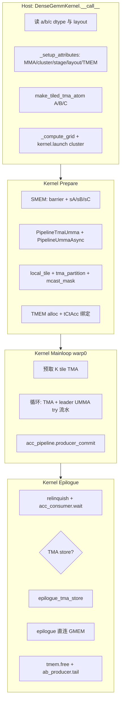

# dense_gemm：可配置 Blackwell 批量 Dense GEMM

以 `gemm/dense_gemm.py` 为例。这是 CUTLASS CuTeDSL 在 **SM100 (Blackwell)** 上的 **生产向** 批量 GEMM 实现，在 `gemm/fp16_gemm_0.py`、[fp16_gemm_1](fp16_gemm_1.md)、[pipeline.md](../pipeline.md) 的 **TMA + UMMA + TMEM + Epilogue** 骨架上，增加 **可配置 dtype/layout/cluster/tile**、**自动 SMEM stage 分配**、**try 流水主循环**、**双 Epilogue 写回路径** 与 **可选逐元素 epilogue**。

相关文档：[fp16_gemm_1.md](fp16_gemm_1.md)、[0_vs_1.md](0_vs_1.md)、[pipeline.md](../pipeline.md)、[smem.md](../smem.md)。

---

## 1. 功能概览

### 1.1 计算问题

\[
C_{M \times N \times L} = A_{M \times K \times L} \times B_{N \times K \times L}
\]

- **L**：batch 维（`mnkl` 中第四维）。
- **A**：`MxKxL`，行主 `"K"` 或列主 `"M"`。
- **B**：`NxKxL`，行主 `"N"` 或列主 `"K"`。
- **C**：`MxNxL`，行主 `"N"` 或列主 `"M"`。

### 1.2 架构特性

| 特性 | 说明 |
|------|------|
| TMA G2S | A/B 从 GMEM 搬到 SMEM，支持 **cluster multicast** 降 L2 流量 |
| tcgen05 UMMA | SMEM 读 A/B，累加器写 **TMEM**；可选 **2CTA**（`CtaGroup.TWO`） |
| 多 stage 流水 | AB pipeline（`PipelineTmaUmma`）+ ACC pipeline（`PipelineUmmaAsync`） |
| Epilogue | TMEM → RMEM →（可选 SMEM）→ GMEM；支持 **`epilogue_op` lambda** |
| TMA S2G | `use_tma_store=True` 时 C 经 SMEM + TMA 写回，可 **多 stage C** |

### 1.3 与 fp16_gemm_0/1 的定位对比

| 项目 | fp16_gemm_0/1 | dense_gemm |
|------|---------------|------------|
| 定位 | 教程、固定配置 | **可配置** 通用 GEMM |
| 批量 L | 无 / 弱 | **显式 batched (RestL)** |
| dtype | 固定 FP16 | FP16/BF16/TF32/INT8/FP8 等组合 |
| Layout | 固定 K-major | A/B/C **主序可配** |
| `ab_stages` | 手写 4 或 7 | **`_compute_stages` 按 SMEM 自动算** |
| 主循环 | `acquire` / `wait` | **prefetch + `try_acquire` / `try_wait`** |
| 写 C | 固定路径 | **TMA store 或 SIMT 直连 GMEM** |
| Epilogue | 固定类型转换 | 可选 **`epilogue_op(x)`**（如 ReLU） |
| 校验 | 示例内 compare | **`can_implement()`** 多维合法性检查 |

---

## 2. 端到端流程



**数据通路：**

```
GMEM ──TMA(multicast)──► SMEM(sA/sB, num_ab_stage)
                            │
                            ▼ UMMA（2CTA 时仅 leader CTA）
                         TMEM(tCtAcc, acc_dtype)
                            │
              ┌─────────────┴─────────────┐
              ▼                           ▼
    epilogue_op + 类型转换          epilogue_op + 类型转换
              │                           │
    RMEM ──► SMEM(sC) ──TMA──► GMEM   RMEM ──SIMT──► GMEM
         (use_tma_store)              (非 TMA store)
```

---

## 3. 核心类 `DenseGemmKernel`

### 3.1 构造参数（`__init__`）

| 参数 | 含义 |
|------|------|
| `acc_dtype` | MMA 累加器类型（如 `Float32`） |
| `use_2cta_instrs` | 是否使用 `CtaGroup.TWO` 的 2CTA MMA |
| `mma_tiler_mn` | MMA tile 的 (M, N)；K 在 `_setup_attributes` 中推导 |
| `cluster_shape_mn` | Cluster (M, N)，launch 时 `cluster=(M,N,1)` |
| `use_tma_store` | C 写回是否经 SMEM + TMA |

固定项：`occupancy=1`，`threads_per_cta=128`。

### 3.2 `_setup_attributes`（依赖输入张量）

在 `__call__` 读到 `a/b/c` 的 dtype 与 layout 后执行：

1. **`make_trivial_tiled_mma`**：按 A/B major、`acc_dtype`、`cta_group`、`mma_tiler_mn` 建 `tiled_mma`。
2. **补全 `mma_tiler`**：K = `mma_inst_shape_k * 4`（与 gemm_0/1 一致）。
3. **`cta_tile_shape_mnk`**：每 CTA 实际负责的 M/N/K tile。
4. **`cluster_layout_vmnk`**：cluster 内 CTA 坐标；推导 **A/B multicast CTA 数**。
5. **`epi_tile`**：TMA store 时用 `compute_epilogue_tile_shape`；否则为 `cta_tile_shape_mnk[:2]`。
6. **`_compute_stages`** → `num_acc_stage`, `num_ab_stage`, `num_c_stage`。
7. **`make_smem_layout_a/b`** 与可选 **`make_smem_layout_epi`**。
8. **`num_tmem_alloc_cols`**：TMEM 列分配。

### 3.3 `__call__`（Host 启动）

1. 校验 `a_dtype == b_dtype`。
2. `_setup_attributes()`。
3. 为 A/B 建 **TMA load atom**（含 cluster multicast、`internal_type` 对 TF32 的特殊处理）。
4. 可选为 C 建 **TMA store atom**。
5. `_compute_grid(c, cta_tile_shape_mnk, cluster_shape_mn)`。
6. `kernel(...).launch(grid, block=[128,1,1], cluster=(M,N,1), stream)`。

---

## 4. Device Kernel 分阶段

### 4.1 Prepare（约 474–700 行）

| 步骤 | 内容 |
|------|------|
| TMA prefetch | warp0 prefetch A/B（及 C）descriptor |
| SharedStorage | `ab_full_mbar`、`acc_full_mbar`、`tmem_dealloc_mbar`、`tmem_holding_buf` |
| Pipeline | `PipelineTmaUmma`（AB）、`PipelineUmmaAsync`（ACC）；`pipeline_init_arrive/wait` |
| SMEM | `sA`、`sB`；`use_tma_store` 时还有 `sC` |
| Multicast | `create_tma_multicast_mask`（A mode=2，B mode=1） |
| 视图 | `local_tile` 含 **RestL**；`tma_partition`；`make_fragment_A/B/C` |
| TMEM | `allocate` → `wait_for_alloc` → `retrieve_ptr` → `tCtAcc` |

**2CTA**：`is_leader_cta = (mma_tile_coord_v == 0)`；仅 leader 执行 UMMA 与 `acc_pipeline.producer_commit`。

### 4.2 Mainloop（约 710–799 行）— 与教程的最大差别

**执行者**：warp 0；UMMA：**leader CTA**。

**两阶段流水：**

```
prefetch_k = min(num_ab_stage - 2, k_tile_cnt)

阶段 A — 预取：
  for k in range(prefetch_k):
    acquire 空 stage → TMA A/B

阶段 B — 主循环：
  for k_tile_idx in range(k_tile_cnt):
    若 k 仍在“未预取”范围 → acquire → TMA
    leader: wait 满 stage → gemm × num_kblocks → release
    try_acquire / try_wait 预取下一轮 empty/full（重叠等待）
```

**原理**：相比 fp16_gemm 固定的 `acquire → wait`，用 **`try_wait` / `try_acquire`** 把下一轮 barrier 等待与当前 UMMA **重叠**，提高流水效率。K 遍历结束后 leader 执行 **`acc_pipeline.producer_commit`**。

### 4.3 Epilogue（约 801–826 行）

1. `tmem.relinquish_alloc_permit()`
2. `acc_pipeline.consumer_wait(acc_consumer_state)`
3. 分支：
   - **`epilogue_tma_store`**：`TMEM → RMEM → SMEM(sC) → TMA → GMEM`，内部 **`PipelineTmaStore`**（`num_c_stage` 可 >1）
   - **`epilogue`**：`TMEM → RMEM → SIMT → GMEM`（按 `epi_tile` 分子块）
4. 两者均在写回前调用 **`epilogue_op(acc_vec.to(c_dtype))`**

**ReLU 示例**（文件头注释）：

```python
epilogue_op = lambda x: cute.where(x > 0, x, cute.full_like(x, 0))
```

### 4.4 收尾（约 828–838 行）

- `pipeline.sync` + `tmem.free`
- warp0 **`ab_producer.tail()`**：2CTA/cluster 下防止 leader 提前退出导致非法 DSMEM 访问

---

## 5. 自动 Stage 分配（`_compute_stages`）

在 SMEM 容量（`utils.get_smem_capacity_in_bytes()`，约 227KB）内启发式划分：

| 量 | 默认 / 计算 |
|----|-------------|
| `num_acc_stage` | 1 |
| `num_c_stage` | TMA store 时初值 2，剩余 SMEM 可再增加 |
| `num_ab_stage` | `(smem_capacity - 预留 - C占用) // (每 stage A+B 字节)` |

**预留**：`mbar_helpers_bytes = 1024`，以及 `(occupancy+1) * (...)` 形式的 barrier / C 占用。

**目标**：在不手写 4/7 的前提下，按 **tile 大小、dtype、是否 TMA store** 尽量多 AB stage，以隐藏 DRAM 延迟（与 fp16_gemm_1 手写 7 stage 的动机一致，但更通用）。

---

## 6. 约束与 `can_implement`

摘自 `DenseGemmKernel` 文档与 `can_implement`：

| 类别 | 约束 |
|------|------|
| A/B dtype | 必须相同；支持 FP16/BF16/TF32/INT8/UINT8/FP8 等组合 |
| MMA tile M | 64/128（1CTA）或 128/256（2CTA） |
| MMA tile N | 32–256，步长 32 |
| Cluster | M/N 为正且为 2 的幂；总 cluster ≤ 16；2CTA 时 M 为 2 的倍数 |
| 对齐 | 连续维 16B 对齐（元素个数为 4/8/16 的倍数，视 dtype） |
| TMA store 关闭 | **不允许 OOB tile**（`is_valid_epilog_store_option`） |

---

## 7. 运行与 Benchmark

### 7.1 示例命令

正确性（默认不跑 benchmark）：

```bash
python gemm/dense_gemm.py \
  --ab_dtype Float16 --c_dtype Float16 --acc_dtype Float32 \
  --mma_tiler_mn 256,128 --cluster_shape_mn 2,1 \
  --mnkl 8192,8192,8192,1 \
  --use_tma_store --use_2cta_instrs
```

性能 benchmark（校验通过后打印 TFLOPS / GB/s，默认 warmup=10、iterations=100）：

```bash
python gemm/dense_gemm.py \
  --ab_dtype Float16 --c_dtype Float16 --acc_dtype Float32 \
  --mma_tiler_mn 256,128 --cluster_shape_mn 2,1 \
  --mnkl 8192,8192,8192,1 \
  --use_tma_store --use_2cta_instrs \
  --benchmark
```

可选：`--warmup_iterations`、`--iterations`、`--use_cold_l2`、`--skip_ref_check`。

### 7.2 Benchmark 输出

`benchmark_dense_gemm()` 在 `--benchmark` 时调用，指标包括：

| 字段 | 含义 |
|------|------|
| Problem (M,N,K,L) | 问题规模（含 batch L） |
| Kernel time | 平均 kernel 时间（μs） |
| Throughput | `2×M×N×K×L / time` → TFLOPS |
| Effective BW | 读 A+B + 写 C 的字节量 / time → GB/s |
| FLOPs / Memory traffic | 绝对量 |

### 7.3 `run()` 流程

1. `create_tensors` 构造 CuTe / PyTorch 张量。
2. `DenseGemmKernel(...)` + `can_implement` 校验。
3. **`cute.compile(gemm, ...)`** 编译。
4. 可选 `compare` 与 PyTorch 参考。
5. 若 `do_benchmark`：`benchmark_dense_gemm`（`cutlass.cute.testing.benchmark`）。

---

## 8. 与 fp16_gemm 系列的关系（学习路径）

```
fp16_gemm_0  →  最小可跑通：1CTA, 固定 tile/stage, 固定流水 API
fp16_gemm_1  →  + 2CTA + multicast + 更深手写 stage
dense_gemm   →  可配置超集 + 自动 stage + try 流水 + batched + 多 dtype + 双 Epilogue
```

读代码建议顺序：**gemm_0 主循环** → **gemm_1 cluster/multicast** → **dense_gemm `_compute_stages` 与 try 流水** → **双 epilogue 路径**。

---

## 9. Jetson Thor（sm_110）与其它平台

### 9.1 `Unsupported compute capability: sm_110`

**原因**：旧版 `nvidia-cutlass-dsl` 的 `SMEM_CAPACITY_MAP` 未包含 `sm_110`；`DenseGemmKernel._setup_attributes` 会调用 `get_smem_capacity_in_bytes()`。

**本仓库处理**：`gemm/dense_gemm.py` 提供 `_get_smem_capacity_in_bytes()`，在查询失败时对 `sm_110` 等架构使用与新版 CUTLASS 一致的回退值（`sm_110` → `(228-1)*1024` 字节）。

**仍建议**：在 Thor 上升级 CUTLASS DSL（`pip install -U nvidia-cutlass-dsl`），或改用面向 **Blackwell GeForce** 的核：

- CUTLASS：`examples/python/CuTeDSL/cute/blackwell_geforce/.../dense_gemm.py`（`Sm120GemmKernel`）
- 本仓库：`hello_cutedsl/hello_cutedsl_matmul_tensorop.py`（capability ≥ 11 自动走 `Sm120GemmKernel`）

### 9.2 架构对应关系

| GPU | CUDA arch | 推荐 GEMM 路径 |
|-----|-----------|----------------|
| B200 等数据中心 Blackwell | sm_100 | 本文件 `DenseGemmKernel`（tcgen05 + TMEM） |
| Jetson Thor、GB10 等 GeForce Blackwell | sm_110 / cap 11.x | **blackwell_geforce** `Sm120GemmKernel`（无 TMEM 累加器路径） |

本 `dense_gemm.py` 为 **SM100 数据中心** 示例；在 Thor 上可能仅能用于学习对照，若 JIT/运行仍失败，请换 GeForce 专用实现。

### 9.3 其它实现注意

- **TMEM 指针**：`TmemAllocator` 应传 `storage.tmem_holding_buf` / `storage.tmem_dealloc_mbar`（勿再 `.ptr`）。
- **源码来源**：与 CUTLASS `examples/blackwell/dense_gemm.py` 同源，本仓库位于 `gemm/dense_gemm.py`。

---

## 10. 一句话总结

**`dense_gemm.py`** 将 Blackwell GEMM 的完整链路封装为 **`DenseGemmKernel`**：可配置 dtype/layout/cluster/tile，自动分配 SMEM stage，主循环用 **预取 + try 流水** 重叠 TMA 与 UMMA，Epilogue 支持 **TMA store 或直连 GMEM** 及 **可选逐元素算子**，是 fp16_gemm 教程 kernel 的 **工程化、通用化** 版本。
