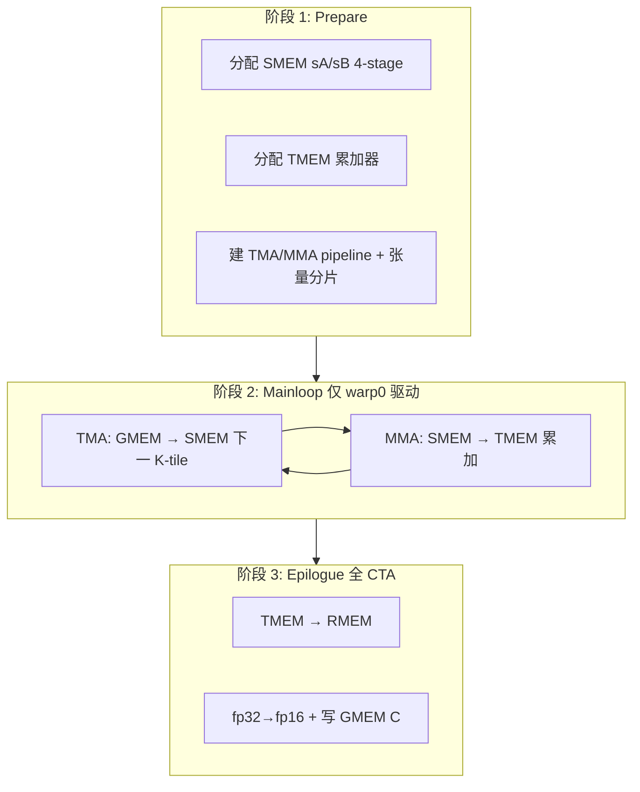

# fp16_gemm_0：Kernel 工作流程

本文分析 [`gemm/fp16_gemm_0.py`](../../gemm/fp16_gemm_0.py) 中 `kernel` 函数（约第 59 行起）的**抽象级**编排：整体流程、计算与内存分工。更细的 TMA 概念见 [`docs/tma.md`](../tma.md)。

---

## 抽象视角：每个 CTA 在算什么

每个 **CTA（block）** 负责输出矩阵 **C** 的一块 **128×256**，在 **K 维** 上对所有 K-tile 累加：

```text
C[bidx, bidy] += Σ_k  A[bidx, k] × B[bidy, k]     （fp16 乘，fp32 累加）
```

`bidx, bidy` 从 GMEM 选中本 block 的 A/B/C 片；**K 在 block 内循环**。

| 参数 | 值 | 含义 |
|------|-----|------|
| `mma_tiler_mnk` | (128, 256, 64) | CTA tile：M×N×K 一步 |
| `mma_inst_shape_mnk` | (128, 256, 16) | 硬件 MMA 单次 K=16 |
| `ab_stages` | 4 | SMEM 上 A/B 环形缓冲段数 |
| `threads_per_cta` | 128 | 每 block 线程数 |

Grid：`(ceil_div(M,128), ceil_div(N,256))`。

---

## 内存层次与分工（编排核心）

```text
GMEM          SMEM (sA,sB)        TMEM           RMEM          GMEM
  A,B  ─TMA─►  4-stage pipeline  ─MMA─►  累加器(fp32)  ─epi─►  C
              (swizzle)            (tcgen05)      (cast+store)
```

| 层次 | 存什么 | 谁写 | 谁读 |
|------|--------|------|------|
| **GMEM** | 全局 A, B, C | Epilogue 写 C | TMA 读 A, B |
| **SMEM** | 当前/下几拍 K 的 A、B tile | **TMA**（producer） | **MMA**（consumer） |
| **TMEM** | 本 block 的 C 累加（fp32） | **MMA** | Epilogue |
| **RMEM** | Epilogue 临时片段 | 线程 | `autovec_copy` → GMEM |

**编排原则**：算（MMA）和搬（TMA）用 **不同引擎 + 多段 SMEM buffer** 重叠；累加放 **TMEM**，算完再一次性写回 GMEM。

---

## 整体三阶段流程



---

## 阶段 1：Prepare（准备与分片）

**目标**：把「本 CTA 要用的地址、buffer、同步」全部建好，还不做 GEMM 算术。

1. **SMEM**：按 `a_smem_layout` / `b_smem_layout`（含 **4 stage**）分配 `sA`、`sB`（含 swizzle，减 bank conflict）。
2. **TMEM**：`TmemAllocator` 分配累加器列（512 列，fp32）。
3. **TMA**：warp 0 `prefetch_descriptor`；`tma_partition` 对齐 GMEM 片 ↔ SMEM stage ↔ MMA 视图。
4. **MMA**：`local_tile` 切本 block 的 `gA` / `gB` / `gC`；`partition_*` / `make_fragment_*` 得到 SMEM/TMEM 上的 MMA 视图。
5. **两条 pipeline**：
   - **AB**：`PipelineTmaUmma`（TMA 生产 → MMA 消费，4 stage）。
   - **Acc**：`PipelineUmmaAsync`（MMA 写完 → Epilogue 读）。

**计算/内存**：几乎无 GEMM；只有分配、映射、barrier 初始化。

---

## 阶段 2：Mainloop（K 维流水，计算与内存重叠）

**驱动**：`if warp_idx == 0` —— **只有 warp 0** 发 TMA + 触发 MMA 序列；其它 warp 参与 barrier / MMA 集体语义及后续 epilogue。

对每个 **K-tile**（`mma_tiler` 的 K=64）：

```text
┌─ Producer (TMA) ─────────────────────────┐
│ acquire 空 stage → copy A,B from GMEM    │
│ → SMEM[stage]（异步，mbarrier）           │
└──────────────────────────────────────────┘
                    ↓  ab_full
┌─ Consumer (MMA) ─────────────────────────┐
│ 对 SMEM[stage] 做 4× gemm (K=16×4)       │
│ 累加到 TMEM（ACCUMULATE）                 │
└──────────────────────────────────────────┘
                    ↓  release stage
（下一 K-tile 可复用该 stage，与 prefetch 重叠）
```

| 编排点 | 含义 |
|--------|------|
| **4 stage SMEM** | TMA 填 stage `i+2` 时，MMA 可读 stage `i` |
| **K 内 4 次 `gemm`** | 硬件 MMA 一次 K=16；64 = 4×16 |
| **`prefetch_stages=ab_stages-2`（即 2）** | K 循环上提前发 TMA |
| **warp 0 发 TMA** | 专用引擎发射，不占满 CTA 做 load |

**计算编排**：Mainloop 的「计算」= **TMEM 上的累加 GEMM**（fp16→fp32）。  
**内存编排**：**GMEM→SMEM（TMA）** 与 **SMEM→TMEM（MMA）** 用 pipeline 错拍。

---

## 阶段 3：Epilogue（写回 C）

**目标**：K 累加结束后，把 TMEM 里 fp32 结果写回 GMEM 的 C（fp16）。

1. 等 **acc_full**（累加完成）。
2. **全 CTA 参与**：TMEM → RMEM（`tmem_tiled_copy`），cast 到 fp16，**`autovec_copy` → GMEM**（`subtile_cnt=4` 分子块，提高 ILP）。
3. 释放 TMEM、同步、`tmem.free`。

**计算编排**：无矩阵乘，只有 **类型转换 + store**。  
**内存编排**：**TMEM → RMEM → GMEM**（不经 SMEM 做整块 C）。

---

## CTA 内并行与角色

| 角色 | 阶段 1 | 阶段 2 | 阶段 3 |
|------|--------|--------|--------|
| **warp 0** | TMA prefetch、pipeline 参与 | **TMA + MMA 发令** | 同左 + epilogue 拷贝 |
| **其它 warp** | 同步、TMEM 分配协作 | 等 barrier / MMA 集体语义 | **TMEM→GMEM 分片写回** |

Epilogue 里 `tmem_thr_copy.get_slice(tidx)` 按线程分片写回。

---

## 与 Host 的衔接

```text
host: tiled_mma + smem_layout(4 stage) + tma_atom + grid(bidx, bidy)
        ↓
kernel: 本 block 的 (128×256) 累加
        = Mainloop(GMEM→SMEM→TMEM) + Epilogue(TMEM→GMEM)
```

Host 侧要点（`host_function`）：

- **`MmaF16BF16Op`**：Blackwell tcgen05 FP16 MMA，指令形状 (128,256,16)，K-major，操作数来自 SMEM。
- **`make_tiled_mma(op)`**：MmaAtom → TiledMma。
- **`make_smem_layout_a/b`**：SMEM layout + swizzle + 4 stage；`select(..., mode=[0,1,2])` 取单 stage 给 TMA。
- **`make_tiled_tma_atom_A/B`**：TMA GMEM→SMEM 描述符 + `tma_tensor`。

---

## 一句话总结

**这个 kernel 把一块 C 的 GEMM 拆成：Prepare 建 SMEM 四段缓冲与 TMEM 累加器；Mainloop 里 warp0 用 TMA 异步灌 A/B、MMA 从 SMEM 累加到 TMEM（K 维流水）；Epilogue 全 CTA 把 TMEM 的 fp32 结果 cast 后写回 GMEM。** 编排本质是 **双流水线（搬数 / 算数）+ 第三段写回**，用 SMEM stage 和 mbarrier 把内存延迟藏在 MMA 后面。

---

## 相关文档

- [TMA 概念与在 GEMM 中的角色](../tma.md)
- [blk_coord 与 tile 选择](../blk_coord.md)
