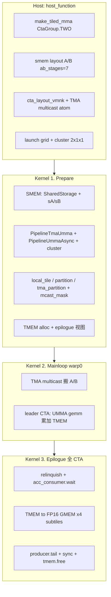

# fp16_gemm_1：2CTA Cluster GEMM 流程与原理

以 `gemm/fp16_gemm_1.py` 为例。本例在 `fp16_gemm_0.py` / [pipeline.md](../pipeline.md) 的 **TMA + UMMA + TMEM + Epilogue** 骨架上，增加 **2CTA MMA**、**CTA Cluster（2×1）** 与 **TMA Multicast**。

---

## 与 fp16_gemm_0 的核心差异

| 项目 | fp16_gemm_0 | fp16_gemm_1 |
|------|-------------|-------------|
| MMA | 1CTA（`CtaGroup.ONE`） | **2CTA**（`CtaGroup.TWO`） |
| Cluster | 无 | **`cluster_shape_mnk = (2, 1, 1)`** |
| CTA tile (M×N×K) | 128×256×64 | **256×256×64**（MMA 跨 2 CTA） |
| MMA 指令形状 | (128, 256, 16) | **(256, 256, 16)** |
| `ab_stages` | 4 | **7**（B 的 per-CTA SMEM 减半） |
| TMA | 普通 G2S | **Multicast G2S** |
| 主循环 UMMA | 全 block warp 0 | **仅 leader CTA** 执行 `gemm` |
| TMEM 分配 | 1CTA | **`is_two_cta=True`** + `tmem_dealloc_mbar` |
| Grid | `ceil_div(M,N,tile)` | **按 cluster 对齐**，M 维 tile 为 256（两 CTA 各 128） |

### 为何往往更快（文件头注释摘要）

1. **更多 AB stage（7 vs 4）**  
   - 1CTA：A stage 16KB + B stage 32KB → 约 4 stage。  
   - 2CTA：每 CTA 只持 B 的一半 → A 16KB + B 16KB → 约 **7 stage**，更好 **隐藏 DRAM 延迟**（约 512×6 vs 1CTA 的 512×3 cycles 量级）。

2. **TMA Multicast 降低 L2 流量**  
   - 2×1 cluster：A 在 V 维广播、B 在 M 维广播，同行/同列 CTA 共享一次 GMEM 读。  
   - 例：约 16KB/1 + 32KB/2 = **24KB** tile 流量（相对无 multicast 的 ~48KB 上限）。

---

## 端到端流程总览



**数据通路（与 gemm_0 相同抽象）：**

```
GMEM ──TMA(multicast)──► SMEM(sA/sB, 7-stage)
                            │
                            ▼ UMMA（2CTA，leader 发指令）
                         TMEM(tCtAcc, FP32)
                            │
                            ▼ Epilogue（cluster 内各 CTA 线程）
                         GMEM(C, FP16)
```

---

## Host 侧：`host_function`（338–432）

### 1. 2CTA Tiled MMA

```python
op = tcgen05.MmaF16BF16Op(..., tcgen05.CtaGroup.TWO, OperandSource.SMEM, ...)
tiled_mma = cute.make_tiled_mma(op)
```

一条 UMMA 指令由 **cluster 内 2 个 CTA** 协同完成 **256×256** 的 M×N 子块（每 CTA 仍对应 128 列/行的分工，由 `thr_id` / `get_slice` 区分）。

### 2. SMEM Layout（7 stage）

```python
a_smem_layout = sm100_utils.make_smem_layout_a(tiled_mma, mma_tiler_mnk, ..., ab_stages=7)
b_smem_layout = sm100_utils.make_smem_layout_b(...)
```

Layout 与 **2CTA、更大 tile** 自动适配；B 的 per-CTA 占用约为 1CTA 的一半，从而腾出 SMEM 给更多 stage。

### 3. Cluster 与 TMA VMNK 布局

```python
cta_layout_mnk = cute.make_layout(cluster_shape_mnk)   # (2,1,1)
cta_layout_vmnk = cute.tiled_divide(cta_layout_mnk, (tiled_mma.thr_id,))
```

- **V 维（mode 0）**：cluster 内 2 个 CTA 在「虚拟 MMA 维」上编号（leader = 0）。  
- **M/N 维**：与 multicast 方向相关（A 沿 mode 2、B 沿 mode 1 等，见 `tma_partition`）。

### 4. TMA Multicast Atom

```python
op = cpasync.CopyBulkTensorTileG2SMulticastOp(tcgen05.CtaGroup.TWO)
a_tma_atom, a_tma_tensor = make_tiled_tma_atom_A(..., cta_layout_vmnk.shape)
```

与 gemm_0 的 `CopyBulkTensorTileG2SOp` + `CtaGroup.ONE` 相对。

### 5. Launch

```python
grid_shape = round_up(ceil_div(shape, (mma_tiler_mnk[0]//2, mma_tiler_mnk[1], ...)), cluster_shape_mnk)
kernel(...).launch(grid=grid_shape, block=[128,1,1], cluster=cluster_shape_mnk)
```

- M 维 tile 有效宽度为 **`mma_tiler_mnk[0]//2 = 128` per CTA**，两个 CTA 合起来 256。  
- **`cluster=(2,1,1)`**：每次 launch 在 cluster 内绑定 2 个 block 协作。

---

## Kernel 阶段 1：Prepare（98–259）

### 1.1 坐标：Cluster + MMA tile

```python
cta_rank_in_cluster = block_idx_in_cluster()
cta_in_cluster_coord_vmnk = cta_layout_vmnk.get_flat_coord(cta_rank_in_cluster)
mma_coord_vmnk = (bidx % size(V), bidx // size(V), bidy, None)
mma_coord_mnk = mma_coord_vmnk[1:]
is_leader_cta = mma_coord_vmnk[0] == 0
```

- **`mma_coord_vmnk[0]`**：cluster 内 **V 槽位**（0 = leader，1 = peer）。  
- **`mma_coord_mnk`**：该 CTA 在全局 M/N/K tile 网格上的坐标（与 gemm_0 的 `(bidx, bidy)` 类似，但 `bidx` 需按 cluster 拆分）。

### 1.2 SMEM 与 Pipeline

与 gemm_0 类似，差异在于：

```python
num_tma_copy_bytes = (size(A_stage) + size(B_stage)) * cute.size(cta_layout_vmnk, mode=[0])
num_tma_producer = num_mcast_ctas_a + num_mcast_ctas_b - 1
ab_consumer = CooperativeGroup(Agent.Thread, num_tma_producer)
acc_consumer = CooperativeGroup(Agent.Thread, size(V) * threads_per_cta)
```

- **`num_tma_copy_bytes`×V 大小**：2CTA 时 TMA 事务与 cluster 规模相关。  
- **`ab_stages=7`**，`barrier_storage` 仍用 `ab_mbar_ptr`。  
- **`cta_layout_vmnk`** 传入 `PipelineTmaUmma.create`，用于 **multicast arrive 掩码** 等。

`SharedStorage` 多 **`tmem_dealloc_mbar`**：2CTA TMEM 释放时 peer CTA 同步用。

### 1.3 张量视图 + TMA Multicast 掩码

```python
thr_mma = tiled_mma.get_slice(mma_coord_vmnk[0])   # 按 cluster 内 V 索引 slice
tma_partition(..., cta_in_cluster_coord_vmnk[2], ...)  # A
tma_partition(..., cta_in_cluster_coord_vmnk[1], ...)  # B
tma_mcast_mask_a = create_tma_multicast_mask(..., mcast_mode=2)
tma_mcast_mask_b = create_tma_multicast_mask(..., mcast_mode=1)
```

- **A**：沿 cluster **V 维（mode 2）** multicast，同行 CTA 共享 GMEM 读。  
- **B**：沿 **M 维（mode 1）** multicast。  
- 主循环 `cute.copy(..., mcast_mask=tma_mcast_mask_a/b)` 启用硬件多播。

### 1.4 TMEM（2CTA）

```python
tmem = TmemAllocator(..., is_two_cta=size(V)>1, two_cta_tmem_dealloc_mbar_ptr=storage.tmem_dealloc_mbar...)
tmem.allocate(512)
tCtAcc = make_tensor(tmem_ptr, tCtAcc.layout)
# epilogue: subtile_cnt=4, tDtC/tDgC/tCrAcc/tCrC（与 gemm_0 同构）
```

2CTA 时 TMEM 分配/释放需 **pair CTA 握手**（dealloc mbar）。

---

## Kernel 阶段 2：Mainloop（261–307）

**仍主要由 warp 0 驱动 TMA**；**UMMA 仅 leader CTA** 执行。

```python
if warp_idx == 0:
    if is_leader_cta:
        acc_producer.acquire_and_advance()
    for _ in range(num_k_tiles, prefetch_stages=ab_stages - 2):   # prefetch_stages=5
        ab_empty = ab_producer.acquire_and_advance()
        cute.copy(..., mcast_mask=tma_mcast_mask_a)   # 两个 CTA 的 warp0 都可发 TMA
        cute.copy(..., mcast_mask=tma_mcast_mask_b)

        if is_leader_cta:
            ab_full = ab_consumer.wait_and_advance()
            for k_block_idx in ...:
                cute.gemm(tiled_mma, tCtAcc, tCrA[...], tCrB[...], tCtAcc)
                tiled_mma.set(ACCUMULATE, True)
            ab_full.release()

    if is_leader_cta:
        acc_producer.commit()
```

| 要点 | 说明 |
|------|------|
| **TMA** | cluster 内各 CTA 的 warp 0 参与加载；multicast 使 **一份 GMEM 数据喂多 CTA SMEM** |
| **UMMA** | 仅 **`is_leader_cta`** 执行 `wait` + `gemm` + `release`；peer CTA 的 SMEM 由 2CTA 指令隐式参与 |
| **`prefetch_stages=5`** | `ab_stages-2`，比 gemm_0 的 2 更大，配合 7-stage 深流水 |
| **`acc_producer`** | 仅 leader `acquire`/`commit`，与 2CTA 累加器所有权一致 |

---

## Kernel 阶段 3：Epilogue（309–335）

与 gemm_0 **结构相同**，参与者为 **cluster 内所有 CTA 的全部线程**（`acc_consumer` 的 arrival count = `size(V) * 128`）。

```python
tmem.relinquish_alloc_permit()
acc_full = acc_consumer.wait_and_advance()
for i in range(NumTiles):   # 4 个子块
    copy TMEM -> tCrAcc; FP32->FP16; autovec_copy -> gC
acc_full.release()

if warp_idx == 0:
    ab_producer.tail()
    if is_leader_cta:
        acc_producer.tail()

pipeline.sync(barrier_id=1)
tmem.free(tmem_ptr)
```

| 步骤 | 作用 |
|------|------|
| `relinquish_alloc_permit` | 放弃 TMEM 分配权，允许全线程 load |
| `acc_consumer.wait` | 等 leader 侧 `acc_producer.commit()` |
| 子 tile 循环 | TMEM FP32 → FP16 → GMEM `C` |
| **`ab_producer.tail()` / `acc_producer.tail()`** | **2CTA 特有**：防止 leader CTA 提前退出导致 **DSMEM / cluster 非法访问** |
| `sync` + `tmem.free` | 2CTA 协调释放 TMEM |

---

## 执行角色小结

| 角色 | TMA | UMMA | Epilogue |
|------|-----|------|----------|
| warp 0，任意 CTA | 发起（带 mcast） | 仅 **leader CTA** | — |
| warp 0，leader | ✓ | ✓ | `tail()` |
| 全 CTA 全线程 | — | — | TMEM→GMEM |

---

## 约束与运行

```bash
# 仅校验
python gemm/fp16_gemm_1.py --mnk 8192,8192,8192

# 校验 + benchmark
python gemm/fp16_gemm_1.py --mnk 8192,8192,8192 --benchmark \
  --warmup_iterations 10 --iterations 100
```

- **M、N 须能被 256 整除**（`mma_tiler_mnk` 的 M×N tile，且 cluster 2 在 M 维配对）。  
- 需要支持 **Blackwell cluster launch** 与 **2CTA UMMA** 的 GPU。  
- 校验：`torch.einsum("mk,nk->mn", ...)` 与 kernel 输出对比。  
- Benchmark：使用 `cute.compile` + `cute.testing.benchmark`，输出 kernel 时间、TFLOPS、有效带宽（与 `fp16_gemm_0.py` 相同）。

---

## 与文档索引

| 主题 | 文档 |
|------|------|
| SMEM / 多 stage | [smem.md](../smem.md) |
| Pipeline / 张量视图 / gemm_0 主循环与 Epilogue | [pipeline.md](../pipeline.md) |
| 本例源码 | `gemm/fp16_gemm_1.py` |

---

---

## 一句话总结

**fp16_gemm_1** 在 gemm_0 的 TMA→SMEM→UMMA→TMEM→Epilogue 流水线上，用 **2×1 CTA cluster + 2CTA MMA** 放大 M×N tile、用 **更浅的 per-CTA B SMEM** 换 **7-stage AB 流水**，并用 **TMA multicast** 降 L2 流量；主循环里 **TMA 多 CTA 协作、UMMA 由 leader CTA 驱动**，Epilogue 全 cluster 写回并 **`producer.tail()`** 安全收尾。
