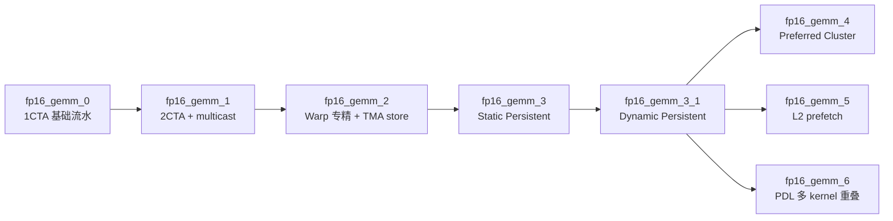

# CUTLASS tutorial_gemm：fp16_gemm 系列实现对比

对比 NVIDIA CUTLASS 教程目录下 **7 个** `fp16_gemm_*.py` 的实现差异与演进关系。

**源码路径**（CUTLASS 仓库）：

`cutlass/examples/python/CuTeDSL/cute/blackwell/tutorial/tutorial_gemm/`

相关文档：[0_vs_1.md](0_vs_1.md)（仅 0/1）、[fp16_gemm.md](fp16_gemm.md)、[dense_gemm.md](dense_gemm.md)。

---

## 1. 总览：演进链



| 文件 | 相对上一版主要新增 | 典型定位 |
|------|------------------|----------|
| **fp16_gemm_0** | 基线 | 学 TMA / UMMA / TMEM / 多 stage 流水 |
| **fp16_gemm_1** | 2CTA + TMA multicast | 学大 cluster、降 L2、加深 stage |
| **fp16_gemm_2** | Warp 专精 + Epilogue TMA store | 学 WS、写回路径 |
| **fp16_gemm_3** | Static Persistent Tile Scheduler | 学持久化 kernel、藏 prologue/epilogue |
| **fp16_gemm_3_1** | Dynamic (CLC) Persistent Scheduler | 学负载均衡、调度 warp |
| **fp16_gemm_4** | Preferred / Fallback Cluster | 学 SM100 双 cluster 形状 launch |
| **fp16_gemm_5** | `cute.prefetch` 进 L2 | 学显式 L2 预取 |
| **fp16_gemm_6** | Programmatic Dependent Launch | 学跨 kernel 重叠（非单 kernel 内） |

同目录还有 `nvfp4_gemm_0/1`（FP4 block-scaled），与 FP16 系列并列，本文不展开。

---

## 2. 核心配置对比表

| 维度 | gemm_0 | gemm_1 | gemm_2 | gemm_3 | gemm_3_1 | gemm_4 | gemm_5 | gemm_6 |
|------|--------|--------|--------|--------|----------|--------|--------|--------|
| **MMA CTA 组** | 1CTA | **2CTA** | 2CTA | 2CTA | 2CTA | 2CTA（双 cluster 形状） | 2CTA | 2CTA |
| **Cluster** | 无 (1,1,1) | **(2,1,1)** | (2,1,1) | (2,1,1) | (2,1,1) | **preferred (2,4,1) + fallback (2,1,1)** | (2,1,1) | (2,1,1) |
| **CTA tile MNK** | **128×256×64** | **256×256×64** | 256×256×64 | 256×256×64 | 256×256×64 | 256×256×64 | **256×64×64** | 256×256×64 |
| **ab_stages** | 4 | **7** | 6 | 6 | 6 | 6 | **10** | 6 |
| **acc_stages** | 1 | 1 | 1 | **2** | 2 | 2 | 2 | 2 |
| **epi_stages** | — | — | **2**（TMA store） | 2 | 2 | 2 | 2 | 2 |
| **Threads/CTA** | **128** | 128 | **192**（6 warps） | 192 | **224**（+sched warp） | 224 | 224 | 192 + 独立 dequant kernel |
| **Warp 分工** | **warp0 包办** load+MMA+epi | warp0（leader MMA） | **TMA/MMA/Epi 分 warp** | 同 2 | 同 2 + **sched** | 同 3_1 | 同 3_1 | 同 3_1 |
| **TMA 写 C** | SIMT 子 tile | SIMT | **TMA store** | TMA store | TMA store | TMA store | TMA store | TMA store |
| **Tile 调度** | 每 tile 一 launch | 每 tile 一 launch | 每 tile 一 launch | **Static Persistent** | **CLC Dynamic Persistent** | Persistent + 双 grid | Dynamic Persistent | Dynamic Persistent |
| **L2 优化** | pipeline prefetch | **multicast** | WS 重叠 | Persistent | Persistent | Preferred cluster 填空闲 SM | **`cute.prefetch`** | — |
| **跨 kernel** | 无 | 无 | 无 | 无 | 无 | 无 | 无 | **PDL** |

---

## 3. 分阶段实现差异

### fp16_gemm_0 — 单 warp 流水线基线

- **1CTA** `CtaGroup.ONE`，无 cluster。
- Tile：**128×256**（M 小于后续版本的 256）。
- **仅 warp 0**：TMA load → UMMA（`cutlass.range(..., prefetch_stages=ab_stages-2)`）→ TMEM → **SIMT** 写 C（子 tile epilogue）。
- `ab_stages=4`；无 warp 专精、无 persistent、无 TMA store。
- **学习点**：`PipelineTmaUmma` + `PipelineUmmaAsync` + `SmemAllocator` + TMEM；代码路径最简单。

与 `study_cute/gemm/fp16_gemm_0.py` 同源思路，教程版更完整（含 benchmark 等）。

---

### fp16_gemm_1 — 2CTA + Multicast

相对 0 的跳跃最大：

- **2CTA** `CtaGroup.TWO`，cluster **(2,1,1)**。
- Tile 升为 **256×256**；`ab_stages=7`（每 CTA 只背一半 B，SMEM 更小 → 更多 stage）。
- **TMA Multicast**：cluster 内共享 GMEM 读；注释约 **24KB/tile** vs 无 multicast 最高约 48KB。
- 仍 **单 warp 逻辑**（warp 0），但 **仅 leader CTA** 执行 `gemm`。
- Epilogue 仍为 **SIMT**，无 TMA store。
- Grid：M 维按 **2CTA 合并**（`mma_tiler[0]//2`）。

详见 [0_vs_1.md](0_vs_1.md)、[fp16_gemm_1.md](fp16_gemm_1.md)。`study_cute/gemm/fp16_gemm_1.py` 与之对齐。

---

### fp16_gemm_2 — Warp 专精 + Epilogue TMA Store

在 gemm_1 基础上：

| Warp | 角色 |
|------|------|
| 0–3 | Epilogue（128 线程，`PipelineTmaStore` + sC stage） |
| 4 | MMA（TMEM 分配、UMMA 主循环） |
| 5 | TMA load（A/B） |

- **任务并行**：TMA 与 TMEM 分配、MMA 指令可重叠；小 K 或 prologue/epilogue 占比大时收益明显。
- **写 C**：RMEM → SMEM → **TMA S2G**（子 tile 流水，隐藏 `st.shared` 与 TMA store）。
- `ab_stages=6`（比 gemm_1 的 7 略少，因 epilogue 占 SMEM）。
- 仍 **非 persistent**：每个 output tile 对应一次 grid 语义（下一版才改）。

---

### fp16_gemm_3 — Static Persistent Scheduler

在 gemm_2 基础上：

- 引入 **`StaticPersistentTileScheduler`**：grid 约 `min(SM 数, tile 数)`，CTA **常驻**处理多个 tile，摊薄 prologue/epilogue。
- **`acc_stages=2`**：累加器 pipeline 与 persistent 循环配合。
- 仅 static 调度；注释说明 **SM 占用不均** 时性能差 → 引出 3_1。
- Block：**192** 线程（无 sched warp）。

---

### fp16_gemm_3_1 — Dynamic (CLC) Persistent Scheduler

相对 gemm_3：

- **`ClcDynamicPersistentTileScheduler`**：动态领任务，缓解 tile 负载不均。
- 新增 **warp 6（sched_warp）**：参与 CLC 调度；block **224** 线程。
- 可选 static/dynamic（`use_clc_dynamic_scheduler`）。
- 成为 **4 / 5 / 6 的共同基底**（注释里多写「相对 3_1」）。

---

### fp16_gemm_4 — Preferred / Fallback Cluster

文件头写 TMA prefetch，但相对 3_1 的**核心增量**是 Blackwell **Preferred Cluster**：

- **preferred (2,4,1)** + **fallback (2,1,1)** 两次 launch / 双 grid，用满「大 cluster 装不下的」SM（例如 18 SM 上 2×2 浪费 2 个 SM 的问题）。
- 仍保留 3_1 的 WS + persistent + TMA store。
- 与 gemm_5 的 **`cute.prefetch` 进 L2** 是不同机制：**4 偏 occupancy / cluster 形状，5 偏 DRAM→L2 预取**。

---

### fp16_gemm_5 — L2 TMA Prefetch

相对 3_1（注释聚焦 prefetch）：

- **`cute.prefetch()`**：主循环前预取 `prefetch_dist` 个 K tile，循环内滚动预取，把数据先拉到 **L2**。
- **`ab_stages=10`**（为 memory-bound 加大流水；SMEM 压力更大）。
- 默认 tile 可为 **256×64×64**（比 256×256 更窄，面向 memory-bound）。
- 仍：WS + dynamic persistent + TMA store。

---

### fp16_gemm_6 — Programmatic Dependent Launch（PDL）

相对 3_1：

- Kernel 内插入 **`griddepcontrol.launch_dependents` / `griddepcontrol.wait`**；host launch 开 PDL。
- **演示场景**：先跑 **dequant** kernel，再跑 GEMM；GEMM 的 prologue 可与 dequant **重叠**（B 依赖 dequant 写完）。
- 仍是单 GEMM 实现 + 额外 dequant；优化在 **kernel 间**，不是单 kernel 内 tile 算法。
- 文档示例 `--mnk 256,8192,128` 上 PDL 相对无 PDL 可达约 **1.16×**（小 M、短 mainloop 时更明显）。

---

## 4. 数据通路与执行模型

**共性（0–6）：**

```
GMEM ──TMA──► SMEM(sA/sB) ──UMMA──► TMEM(acc) ──► RMEM ──► (SMEM sC) ──► GMEM(C)
                                              ↑ gemm_0/1: 直接 SIMT 写 C
                                              ↑ gemm_2+: 常经 TMA store
```

**分叉点：**

| 主题 | gemm_0 | gemm_1+ |
|------|--------|---------|
| Cluster / multicast | 无 | 有 |
| 谁发 UMMA | 全 CTA warp0 | leader CTA + 专责 MMA warp |
| 谁搬 A/B | warp0 | 专责 TMA warp |
| 谁写 C | warp0 SIMT | 专责 Epi warps + TMA |
| 多少 tile / launch | 一 tile 一 block 网格 | Persistent 循环多 tile |
| L2 | pipeline 隐藏延迟 | multicast +（5）显式 prefetch +（4）cluster 填 SM |

---

## 5. 与 study_cute 仓库的关系

| 教程（CUTLASS） | study_cute |
|----------------|------------|
| `fp16_gemm_0.py` | `gemm/fp16_gemm_0.py` |
| `fp16_gemm_1.py` | `gemm/fp16_gemm_1.py` |
| `fp16_gemm_2` ~ `6` | 一般无对应拷贝，需在 CUTLASS 树内阅读 |

学 Blackwell GEMM：**0→1→2** 可与本仓库 `gemm/` 对照；**3+** 面向更大问题规模与生产向调度 / cluster / PDL。

---

## 6. 阅读与实验顺序建议

| 目标 | 建议读 |
|------|--------|
| 理解最小 GEMM 骨架（TMA/UMMA/TMEM） | **0** |
| 理解 2CTA + multicast | **1**（+ [0_vs_1.md](0_vs_1.md)） |
| 理解 warp 专精 + TMA store（接近 dense_gemm / fmha 分工） | **2** |
| 理解 persistent kernel | **3 → 3_1** |
| 非整 cluster SM 占用（数据中心 GPU） | **4** |
| 极致 memory-bound、加深 stage + L2 | **5** |
| 算子融合 / 多 kernel 流水 | **6** |

---

## 7. 一句话总结

**fp16_gemm 系列是一条从「单 CTA、单 warp 教程 kernel」→「2CTA 多播」→「warp 专精与 TMA 写回」→「持久化 tile 调度」→「动态调度」→「cluster 与 L2 微优化」→「跨 kernel PDL」的递进课程。**

- **0/1** 差异最大（架构从 1CTA 到 2CTA）。
- **2 起**主要是执行模型与调度。
- **4 与 5** 解决不同层面的内存/占用问题，不要混为一谈。
