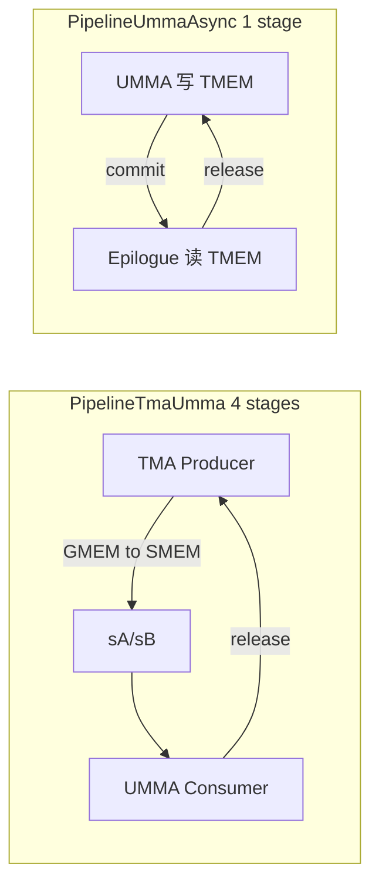
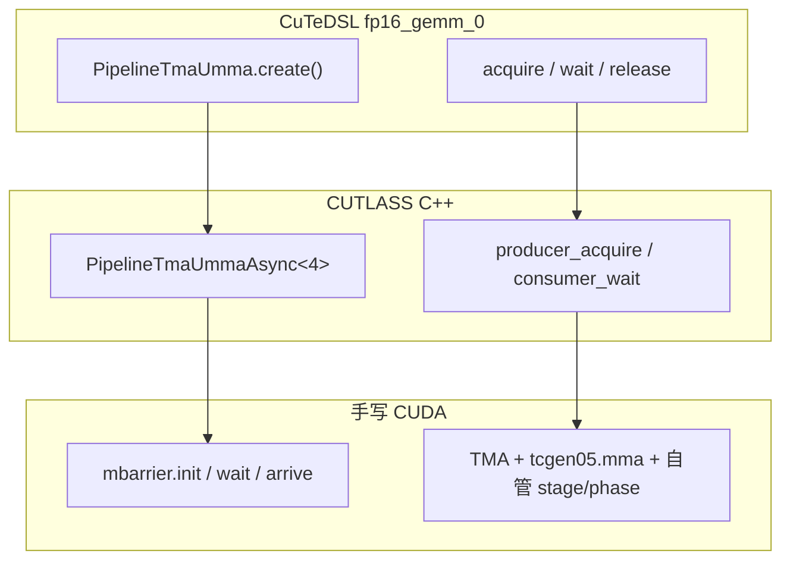
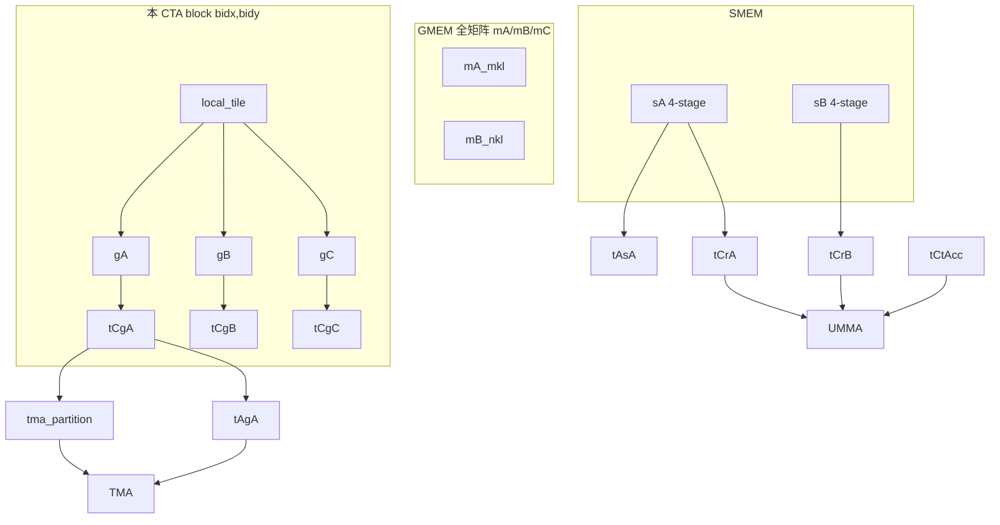
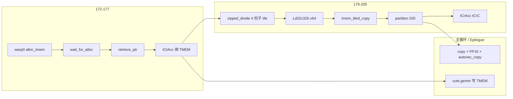
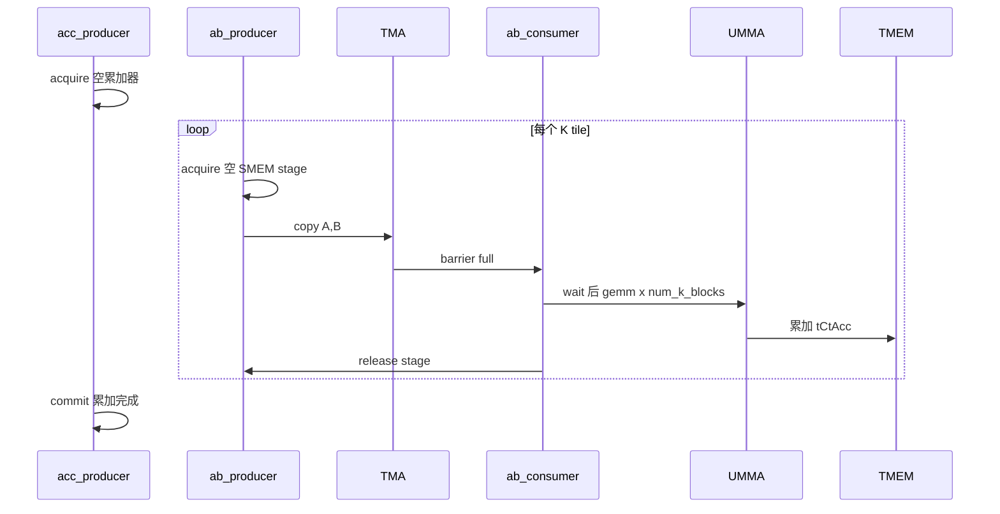

# fp16_gemm_0 中的 Pipeline（流水线）

以 `gemm/fp16_gemm_0.py` 为例，说明 kernel 内两条软件流水线的配置、与 `SharedStorage` 的关系，以及 CuTeDSL / CUTLASS C++ / 裸 CUDA 的对应关系。

## Kernel 内的 Pipeline 配置（约 113–132 行）

```python
num_tma_copy_bytes = cute.size_in_bytes(...) + cute.size_in_bytes(...)  # 单 stage A+B
ab_producer, ab_consumer = pipeline.PipelineTmaUmma.create(
    num_stages=ab_stages,          # 4
    producer_group=...Thread,
    consumer_group=...Thread,
    tx_count=num_tma_copy_bytes,
    barrier_storage=storage.ab_mbar_ptr.data_ptr(),
).make_participants()
acc_producer, acc_consumer = pipeline.PipelineUmmaAsync.create(
    num_stages=acc_stage,          # 1
    producer_group=...Thread,
    consumer_group=...Thread, threads_per_cta,  # 128
    barrier_storage=storage.acc_mbar_ptr.data_ptr(),
).make_participants()
```

在主循环之前建立 **两套生产者–消费者流水线**，用 SMEM 里的 **mbarrier** 协调 TMA、UMMA、Epilogue，使它们能安全重叠。



### 1. `num_tma_copy_bytes`

对 **单个 pipeline stage** 的 A、B SMEM layout 求字节和（`cute.select(..., mode=[0,1,2])` 去掉 stage 维）。  
告知 barrier：一次 TMA 会写入多少字节，用于 `mbarrier` 的 arrive-and-expect-tx。

### 2. `PipelineTmaUmma`：A/B 的 TMA ↔ UMMA

| 参数 | 本例 | 含义 |
|------|------|------|
| `num_stages` | `ab_stages = 4` | 与 `sA`/`sB` 四段 SMEM 环形缓冲对应 |
| `producer_group` | `Agent.Thread` | TMA 由线程发起（主循环 `cute.copy`） |
| `consumer_group` | `Agent.Thread` | UMMA 消费同组线程的 SMEM |
| `tx_count` | `num_tma_copy_bytes` | 每次 TMA 字节数 |
| `barrier_storage` | `storage.ab_mbar_ptr` | `ab_stages * 2` 个 Int64 的 mbarrier 存储 |

主循环（warp 0）典型用法：

- **Producer**：`ab_empty = ab_producer.acquire_and_advance()` → 空 stage → TMA → barrier 在 copy 里 signal  
- **Consumer**：`ab_full = ab_consumer.wait_and_advance()` → 等 TMA 完成 → `cute.gemm` → `ab_full.release()`  

作用：在 K 维上重叠「下一 tile 的 TMA」与「当前 tile 的 UMMA」。

### 3. `PipelineUmmaAsync`：累加器 UMMA ↔ Epilogue

| 参数 | 本例 | 含义 |
|------|------|------|
| `num_stages` | `acc_stage = 1` | TMEM 累加器单 stage |
| `producer_group` | `Agent.Thread` | UMMA 写 TMEM |
| `consumer_group` | `Agent.Thread, 128` | **全 CTA** 参与 epilogue |
| `barrier_storage` | `storage.acc_mbar_ptr` | 累加器 pipeline 的 mbarrier |

典型用法：

- 主循环前：`acc_empty = acc_producer.acquire_and_advance()`  
- K 循环结束：`acc_empty.commit()`  
- Epilogue：`acc_full = acc_consumer.wait_and_advance()` → TMEM→GMEM → `acc_full.release()`  

与 AB 流水线的区别：consumer 为整个 CTA（128 线程），因 epilogue 每线程都要做 TMEM load / 写回。

### 4. 与 `SharedStorage` 的关系

```python
class SharedStorage:
    ab_mbar_ptr: MemRange[Int64, ab_stages * 2]   # 4 * 2
    acc_mbar_ptr: MemRange[Int64, acc_stage * 2]  # 1 * 2
    tmem_holding_buf: Int32
```

113–132 行把 mbarrier 绑定到具体 pipeline 语义；无此配置，后面的 `acquire` / `wait` / `release` / `commit` 无法工作。  
SMEM 矩阵缓冲与 stage 的更多说明见 [smem.md](smem.md)。

### 小结表

| 流水线 | 生产者 | 消费者 | Stage | 协调对象 |
|--------|--------|--------|-------|----------|
| `PipelineTmaUmma` | TMA → SMEM | UMMA 读 SMEM | 4 | `sA`/`sB` + `ab_mbar_ptr` |
| `PipelineUmmaAsync` | UMMA → TMEM | Epilogue 读 TMEM | 1 | `tCtAcc` + `acc_mbar_ptr` |

---

## 是 CUTLASS 封装好的吗？

**是。** `PipelineTmaUmma.create` / `PipelineUmmaAsync.create` 是 **CUTLASS 在 CuTeDSL 里的封装**，底层会生成：

- SMEM 中 `mbarrier` 的初始化  
- `phase` / `index` 状态机（环形 buffer）  
- 与 TMA（`tx_count`）、UMMA（`umma_arrive` 等）绑定的 arrive / wait  

应用侧主要做 **配置**（stage 数、生产者/消费者角色、字节数、barrier 指针），一般 **不必手写每一条 PTX**。

| CuTeDSL（Python） | 底层 |
|-------------------|------|
| `barrier_storage=...data_ptr()` | SMEM 里每组 stage 常有一对 empty/full barrier |
| `acquire_and_advance` / `wait_and_advance` | 等 empty 或 full，推进 stage |
| `release` / `commit` | 消费者/生产者释放，翻转 phase |
| `tx_count` | TMA 完成时的 expect_tx |

Python 模块 `cutlass/pipeline/sm100.py` 中 `PipelineTmaUmma` 注释：*TMA producers and UMMA consumers*。  
与 **CUTLASS C++** 为同一套设计，仅语言不同。

---

## 传统 CUDA C++ 一般怎么写

### 1. CUTLASS / CuTe C++（与 fp16_gemm_0 最接近）

```cpp
using PipelineLoad = cutlass::PipelineTmaUmmaAsync<4>;
using PipelineAcc  = cutlass::PipelineUmmaAsync<1>;

struct SharedStorage {
  typename PipelineLoad::SharedStorage load;
  typename PipelineAcc::SharedStorage acc;
};

PipelineLoad pipeline_load(storage.load, params, cluster_shape);
PipelineAcc  pipeline_acc(storage.acc, params, cluster_shape);

PipelineState<4> load_producer = make_producer_start_state<PipelineLoad>();
PipelineState<4> load_consumer = {0, 0, 0};

pipeline_load.producer_acquire(load_producer);
// TMA copy + barrier signal
pipeline_load.producer_commit(load_producer);

pipeline_load.consumer_wait(load_consumer);
// cute::gemm / UMMA
pipeline_load.consumer_release(load_consumer);
```

头文件见 CUTLASS `include/cutlass/pipeline/sm100_pipeline.hpp`（`PipelineTmaUmmaAsync`、`PipelineUmmaAsync`）。  
量产 GEMM 常藏在 `GemmUniversal` / `collective_mma` 中，但底层仍是同类 pipeline。

### 2. 裸 CUDA + Hopper/Blackwell 原语

不经过 CUTLASS pipeline 类时，需自行维护：

```cpp
__shared__ uint64_t full_bar[4];
__shared__ uint64_t empty_bar[4];

// init（通常单 warp）
mbarrier.init(&empty_bar[s], ...);
mbarrier.init(&full_bar[s], ...);

// Producer：等空 → TMA → signal full（含 tx 字节数）
mbarrier.wait(&empty_bar[stage], phase);
cp.async.bulk.tensor(..., &full_bar[stage]);

// Consumer：等满 → MMA → release empty
mbarrier.wait(&full_bar[stage], phase);
// tcgen05.mma / wgmma
mbarrier.arrive(&empty_bar[stage]);
// 手动 stage++、phase ^= 1
```

难点：phase 翻转、cluster multicast、TMA tx 计数、UMMA `umma_arrive` 等须与硬件语义一致；CUTLASS pipeline 即将该模式固化成可复用 API。

### 3. 更老的 Ampere 风格（对比）

无 TMA/mbarrier 时常见 `cp.async` + `wait_group`，或 SMEM 自旋信号量。  
Blackwell GEMM 主路径以 **TMA + mbarrier + UMMA** 为主，与 fp16_gemm_0 更相关的是上两档。

---

## 三层对照



| 层次 | 你要写什么 | pipeline 逻辑谁实现 |
|------|----------|---------------------|
| **CuTeDSL** | `create` + `make_participants` + 主循环 `acquire`/`release` | CUTLASS Python → MLIR → PTX |
| **CUTLASS C++** | `SharedStorage` + `Pipeline*` + `PipelineState` | `sm90/sm100_pipeline.hpp` |
| **裸 CUDA** | 全部 barrier、stage、phase、TMA/MMA 顺序 | 自行实现 |

**结论**：不是「只有 CUTLASS 有 pipeline」；而是库把 **多 stage 生产者–消费者 + mbarrier** 封装好了。传统写法要么用同一套 C++ 类，要么手写 mbarrier/TMA，工作量和出错面都更大。fp16_gemm_0 把 `create` 暴露在 kernel 里，便于对照主循环；完整 GEMM 往往藏在更高层 collective 中。

---

## 相关代码位置

| 内容 | 路径 |
|------|------|
| kernel 内 pipeline 配置与主循环 | `gemm/fp16_gemm_0.py` |
| 张量切分与 TMA/MMA 视图（约 134–170 行） | 见下文「张量切分」 |
| TMEM 绑定与 Epilogue 准备（约 172–205 行） | 见下文「TMEM 与 Epilogue」 |
| 主循环 Mainloop（约 210–248 行） | 见下文「主循环」 |
| Epilogue 写回与释放 TMEM（约 250–271 行） | 见下文「Epilogue」 |
| SMEM / stage 与 `SharedStorage` | [smem.md](smem.md) |
| CuTeDSL pipeline | CUTLASS `python/CuTeDSL/cutlass/pipeline/sm100.py` |
| C++ pipeline | CUTLASS `include/cutlass/pipeline/sm100_pipeline.hpp` |

---

## 张量切分与视图对齐（约 134–170 行）

Pipeline 配置完成后，紧接的是 **「张量切分与视图对齐」**：把 **GMEM 全矩阵**、**本 CTA 的 SMEM**、**UMMA**、**TMA** 用同一套下标/layout 连起来，主循环只使用这里造好的视图。

> **先定「这个 block 算哪一块 tile」→ 再定「MMA 怎么看 GMEM/SMEM」→ 最后定「TMA 从 GMEM 哪拷到 SMEM 哪」。**

主循环中的用法：

```python
cute.copy(tma_atom_a, tAgA[(None, ab_empty.count)], tAsA[(None, ab_empty.index)], ...)
cute.copy(tma_atom_b, tBgB[(None, ab_empty.count)], tBsB[(None, ab_empty.index)], ...)
cute.gemm(tiled_mma, tCtAcc, tCrA[k_block_coord], tCrB[k_block_coord], tCtAcc)
```



### 逻辑分三层

| 层次 | 代码 | 作用 |
|------|------|------|
| **1. CTA 级 GMEM tile** | `local_tile` → `gA/gB/gC` | 从全局张量切出本 block 负责的 `(bM,bN,bK,…)` |
| **2. MMA 视图** | `partition_A/B/C` + `make_fragment_A/B/C` | UMMA 从哪读操作数、累加器形状；`tCg*` 对 GMEM，`tCr*` 对 SMEM |
| **3. TMA 视图** | `tma_partition` → `tAgA,tAsA` 等 | TMA 源 (GMEM) 与目的 (SMEM) 与 MMA 分区对齐 |

### 第一层：`local_tile`

```python
mma_coord_mnk = (bidx, bidy, None)
gA = cute.local_tile(mA_mkl, mma_tiler_mnk, mma_coord_mnk, proj=(1, None, 1))   # (bM, bK, RestK)
gB = cute.local_tile(mB_nkl, mma_tiler_mnk, mma_coord_mnk, proj=(None, 1, 1))  # (bN, bK, RestK)
gC = cute.local_tile(mC_mnl, mma_tiler_mnk, mma_coord_mnk, proj=(1, 1, None)) # (bM, bN)
```

- `mma_tiler_mnk = (128, 256, 64)`：每 CTA 在 M×N×K 上的静态 tile。
- `proj` 决定保留哪些维；`RestK` 为主循环 K 方向 tile 数（`num_k_tiles = cute.size(gA, mode=[2])`）。
- `gA/gB/gC` 仍是 GMEM 逻辑视图，范围限在本 block。

### 第二层：MMA 分区

```python
thr_mma = tiled_mma.get_slice(0)
tCgA = thr_mma.partition_A(gA)
tCgB = thr_mma.partition_B(gB)
tCgC = thr_mma.partition_C(gC)

tCrA = tiled_mma.make_fragment_A(sA)
tCrB = tiled_mma.make_fragment_B(sB)
acc_shape = tiled_mma.partition_shape_C(mma_tiler_mnk[:2])
tCtAcc = tiled_mma.make_fragment_C(acc_shape)
```

| 名字 | 存储 | 用途 |
|------|------|------|
| `tCgA/B/C` | GMEM | TMA 源索引、epilogue 写 C；与 TiledMma 指令形状对齐 |
| `tCrA/B` | SMEM (`sA/sB`) | `cute.gemm` 的 A/B 操作数 |
| `tCtAcc` | 逻辑 layout，后绑 TMEM | `cute.gemm` 累加器（约 177 行 `make_tensor(tmem_ptr, ...)`） |

`get_slice(0)`：本教程由 warp 0 发 UMMA，取 tiled_mma 的一个 slice。

### 第三层：`tma_partition`

```python
tAsA, tAgA = cute.nvgpu.cpasync.tma_partition(
    tma_atom_a, 0, cute.make_layout(1),
    cute.group_modes(sA, 0, 3),
    cute.group_modes(tCgA, 0, 3),
)
# B → tBsB, tBgB
```

| 视图 | 存储 | 主循环索引 |
|------|------|------------|
| `tAgA` / `tBgB` | GMEM 源 | `[(None, ab_empty.count)]`（第几个 K tile） |
| `tAsA` / `tBsB` | SMEM 目的 | `[(None, ab_empty.index)]`（pipeline stage） |

`group_modes(..., 0, 3)` 将前 3 个 mode 合成 TMA 坐标，与 host 侧 `make_tiled_tma_atom_A/B` 一致。  
作用：**TMA 写入的 SMEM 布局 = UMMA 读取的 `tCrA/tCrB` 布局**，GMEM 源与 `tCgA/tCgB` 一致。

### 命名习惯

| 前缀 | 含义 | 例 |
|------|------|-----|
| `g` | GMEM、本 CTA tile | `gA` |
| `s` | SMEM 缓冲 | `sA` |
| `tCg` | GMEM，MMA 分区 | `tCgA` |
| `tCr` | SMEM/reg，MMA fragment | `tCrA` |
| `tCt` | 累加器（常绑 TMEM） | `tCtAcc` |
| `tAg` / `tAs` | TMA 源 / 目的 | `tAgA`, `tAsA` |

### 与前后代码的关系

| 阶段 | 行号约 | 内容 |
|------|--------|------|
| 之前 | 80–132 | SMEM/TMEM、pipeline — **资源与同步** |
| **本段** | 134–170 | **地址与 layout 绑定** — TMA/UMMA 索引规则 |
| 之后 | 172–205 | TMEM 绑定、Epilogue 视图；再进入主循环 |

**小结**：本段不发起计算，只为当前 CTA 建立 **GMEM tile → MMA 分区 → SMEM fragment → TMA 源/宿** 映射，保证 `cute.copy` 与 `cute.gemm` 使用同一套几何划分。

---

## TMEM 绑定与 Epilogue 准备（约 172–205 行）

位于 **主循环之前**，完成两件事：

1. 把累加器 `tCtAcc` **绑到真实 TMEM**（此前只有 layout）
2. 为 **Epilogue（第 3 段）** 搭好 TMEM → 寄存器 → GMEM 的搬运视图

与「张量切分」段的分工：134–170 解决 **TMA/UMMA 的 GMEM↔SMEM**；本段解决 **UMMA 写 TMEM ↔ 写回 GMEM**。



### 1. TMEM 同步与累加器绑定（172–177）

```python
tmem.wait_for_alloc()
tmem_ptr = tmem.retrieve_ptr(acc_dtype)
tCtAcc = cute.make_tensor(tmem_ptr, tCtAcc.layout)
```

| 步骤 | 作用 |
|------|------|
| `wait_for_alloc()` | CTA 级 barrier；仅 warp 0 执行 `alloc_tmem`，其余 warp 等地址写入 `tmem_holding_buf` |
| `retrieve_ptr(acc_dtype)` | 从 SMEM 握手缓冲读出 **TMEM 基址**（FP32） |
| `make_tensor(tmem_ptr, tCtAcc.layout)` | 保留累加器 layout，底层存储改为 TMEM |

主循环 `cute.gemm(..., tCtAcc, ...)` 写入的即是这块 TMEM。

### 2. Epilogue 子划分（179–187）

```python
subtile_cnt = 4
epi_tiler = (size(tCtAcc M), size(tCtAcc N) // 4)
tCtAcc_epi = cute.zipped_divide(tCtAcc, epi_tiler)
gC_epi = cute.zipped_divide(tCgC, epi_tiler)
```

- CTA tile **128×256**，在 **N 向切 4 份** → 每份约 **128×64**。
- 得到 `(EpiTile, NumTiles)`，`NumTiles=4`。
- `gC_epi` 与 `tCtAcc_epi` 同一划分，保证 TMEM 源与 GMEM 目的子块对齐。

目的：Epilogue 分 4 次写回（`for i in range(4)`），提高指令级并行，避免一次搬整块 tile。

### 3. TMEM Load 与 Tiled Copy（189–200）

```python
tmem_atom = cute.make_copy_atom(tcgen05.Ld32x32bOp(Repetition.x64), Float32)
tmem_tiled_copy = tcgen05.make_tmem_copy(tmem_atom, tCtAcc_epi[None, 0])
tmem_thr_copy = tmem_tiled_copy.get_slice(tidx)
tDtC = tmem_thr_copy.partition_S(tCtAcc_epi)
tDgC = tmem_thr_copy.partition_D(gC_epi)
```

| 对象 | 含义 |
|------|------|
| `Ld32x32bOp` + `x64` | 每线程一次从 TMEM 搬 **64 个 FP32** |
| `tDtC` | 源：TMEM 累加器 `(TmemCpy, NumTmemCpy, NumTiles)` |
| `tDgC` | 宿：GMEM `gC` 对应子块 |

Epilogue 中（约 262–265 行）：

```python
cute.copy(tmem_tiled_copy, tDtC[None, None, i], tCrAcc)
tCrC.store(tCrAcc.load().to(io_dtype))
cute.autovec_copy(tCrC, tDgC[None, None, i])
```

即 **TMEM → 寄存器(FP32) → 转 FP16 → 向量写 GMEM**。

### 4. 寄存器缓冲（202–205）

```python
tCrAcc = cute.make_rmem_tensor(..., acc_dtype)   # FP32 暂存
tCrC = cute.make_rmem_tensor(..., io_dtype)     # FP16 写回前缓冲
```

形状与本线程在单个 epilogue 子 tile 上的份额一致；**主循环不使用**，仅 Epilogue 使用。

### 5. 与主循环、Pipeline 的衔接

| 阶段 | 执行者 | 与本段关系 |
|------|--------|------------|
| 主循环 `cute.gemm` | warp 0 | 写入 177 行绑定的 `tCtAcc`（TMEM） |
| `acc_empty.commit()` | warp 0 | 通知累加完成 |
| `acc_consumer.wait_and_advance()` | 全 CTA 128 线程 | 258 行：再等 UMMA 完成后读 TMEM |
| Epilogue | 全 CTA | 用 `tDtC`/`tDgC`/`tCrAcc`/`tCrC` 写回 |

172–205 行 **只做视图准备**；真正读 TMEM 在 K 循环结束且 `acc_full` 之后。

### 小结

| 行号 | 作用 |
|------|------|
| 172–177 | 同步后把 `tCtAcc` 绑到 TMEM，供 UMMA 累加 |
| 179–187 | 累加器与 `gC` 在 N 向切 4 份，对齐 epilogue |
| 189–200 | 配置 TMEM load 及每线程源/宿分区 |
| 202–205 | Epilogue 用 FP32/FP16 寄存器缓冲 |

**一句话**：完成 **「累加器落位 TMEM」+「写回 GMEM 的搬运施工图」**；算术仍在后续主循环与 Epilogue 中执行。

---

## 主循环 Mainloop（约 210–248 行）

Kernel 的 **K 维主循环**：反复「搬一块 A/B → UMMA 累加到 TMEM」，直到本 CTA 的 GEMM 完成。  
**仅 warp 0** 执行 TMA 与 `cute.gemm`；其它 warp 在本段空闲，在 Epilogue（约 258 行起）由全 CTA 写回 `C`。



### `num_k_tiles`（210）

```python
num_k_tiles = cute.size(gA, mode=[2])
```

`gA` 为 `(bM, bK, RestK)`，`mode=[2]` 是沿全局 K 的 tile 个数。  
例：全局 `K=8192`、`mma_tiler K=64` → `num_k_tiles = 128`。

### 累加器 pipeline 头尾（212–213，247–248）

```python
acc_empty = acc_producer.acquire_and_advance()   # 循环前
# ... K 循环 ...
acc_empty.commit()                               # 全部 K 结束后
```

- **开始前**：申请可写的空累加器（TMEM 上 `tCtAcc`）。
- **结束后**：`commit()` 通知 Epilogue 可读 TMEM（对应 `acc_consumer.wait`，约 258 行）。

### K 循环与预取（214）

```python
for k_tile_idx in cutlass.range(num_k_tiles, prefetch_stages=ab_stages - 2):
```

`ab_stages=4` → `prefetch_stages=2`：约 2 个 TMA 可与 UMMA 重叠，配合 4-stage SMEM 环形缓冲。

### 生产者：TMA → SMEM（216–228）

```python
ab_empty = ab_producer.acquire_and_advance()
cute.copy(..., tAgA[(None, ab_empty.count)], tAsA[(None, ab_empty.index)], tma_bar_ptr=ab_empty.barrier)
```

| 下标 | 含义 |
|------|------|
| `ab_empty.count` | 第几个 **K tile**（GMEM 源） |
| `ab_empty.index` | SMEM **stage**（0..3） |
| `ab_empty.barrier` | 本次 TMA 的 mbarrier |

一次迭代搬当前 K 上整块 A/B（本 CTA：约 128×64、256×64 FP16）到 `sA`/`sB` 的某一 stage。

### 消费者：等 TMA → UMMA（230–242）

```python
ab_full = ab_consumer.wait_and_advance()
for k_block_idx in cutlass.range_constexpr(num_k_blocks):
    cute.gemm(tiled_mma, tCtAcc, tCrA[k_block_coord], tCrB[k_block_coord], tCtAcc)
    tiled_mma.set(tcgen05.Field.ACCUMULATE, True)
```

1. **`wait_and_advance`**：等当前 stage 的 TMA 完成。  
2. **`num_k_blocks`**：`mma_tiler K=64`、`mma_inst K=16` → 每 K tile **4 次** UMMA。  
3. **`cute.gemm`**：SMEM → **TMEM** `tCtAcc`。  
4. **`ACCUMULATE=True`**：首次后可累加；跨 K tile 在同一 `tCtAcc` 上完成 \(C \mathrel{+}= A \times B\)。

`k_block_coord` 中 `ab_full.index` 对应当前 SMEM stage。

### 释放 SMEM stage（245）

```python
ab_full.release()
```

UMMA 用完后归还 stage，供下一轮 TMA 写入。

### 单次 K tile 数据流

```
GMEM A/B（第 k 个 K tile）─TMA─► sA/sB[stage]
                              ─UMMA×4─► tCtAcc (TMEM) +=
```

全部 `k_tile_idx` 结束后，本 CTA **128×256** 的 FP32 部分和在 TMEM 中。

### 依赖关系

| 依赖 | 说明 |
|------|------|
| Pipeline（113–132） | `ab_*` / `acc_producer` 的 acquire、wait、release、commit |
| 张量视图（134–170） | `tAgA`、`tAsA`、`tCrA` 等下标 |
| TMEM 绑定（172–177） | `tCtAcc` 已指向 TMEM |
| Epilogue（250+） | `acc_empty.commit()` 之后全 CTA 写 GMEM |

### 小结

| 要点 | 作用 |
|------|------|
| 仅 warp 0 | 统一 TMA + UMMA |
| 外循环 `num_k_tiles` | 沿全局 K 推进 |
| `prefetch_stages=2` | TMA/UMMA 重叠 |
| TMA + `ab_*` pipeline | GMEM → SMEM，4 stage |
| `cute.gemm` × `num_k_blocks` | SMEM → TMEM 累加 |
| `acc_empty.commit()` | 通知 Epilogue |

**一句话**：K 维主循环用 4-stage TMA 流水搬 A/B，UMMA 分块累加到 TMEM，算完整个 K 后交给 Epilogue 写回 `C`。

---

## Epilogue 写回与释放 TMEM（约 250–271 行）

主循环（warp 0）在 TMEM 中完成 FP32 累加后，**全 CTA 128 线程**将结果写回 **GMEM 的 C（FP16）**，并 **释放 TMEM**。


| 阶段 | 执行者 | 做什么 |
|------|--------|--------|
| Mainloop | warp 0 | TMA + UMMA → TMEM |
| **Epilogue** | **全 CTA** | TMEM → 寄存器 → GMEM C |

172–205 行已准备 `tDtC`、`tDgC`、`tCrAcc`、`tCrC`；本段 **执行** 搬运。

### 1. `tmem.relinquish_alloc_permit()`（254–255）

Blackwell 上，**分配 TMEM 的 warp**（默认 warp 0）在不再申请更多列后，须 **放弃分配许可**，硬件才允许其它 warp 对这块 TMEM 做 load。

- 主循环：warp 0 用 UMMA **写** TMEM。  
- Epilogue：**所有线程** **读** TMEM。

**原理**：TMEM 分配与使用是分阶段、分角色的硬件协议。

### 2. `acc_full = acc_consumer.wait_and_advance()`（257–258）

对接 `PipelineUmmaAsync` 与主循环 `acc_empty.commit()`（248 行）：

- **Producer（warp 0）**：`commit()` = 累加器已写好。  
- **Consumer（全 CTA）**：`wait()` = 可以读 TMEM。

**原理**：mbarrier 流水线保证 **先算完、再读**，避免读到未完成累加。

### 3. 子 tile 循环写回（260–265）

```python
for i in cutlass.range(cute.size(tDtC, mode=[2])):   # 通常 0..3
    cute.copy(tmem_tiled_copy, tDtC[None, None, i], tCrAcc)
    tCrC.store(tCrAcc.load().to(io_dtype))
    cute.autovec_copy(tCrC, tDgC[None, None, i])
```

| 步骤 | 作用 |
|------|------|
| `cute.copy(tmem_tiled_copy, ...)` | TMEM → `tCrAcc`（FP32，Ld32x32b x64） |
| `.to(io_dtype)` | FP32 → **FP16**（输出 C 的类型） |
| `autovec_copy` | 寄存器 → GMEM `tDgC` |

`NumTiles=4` 来自 179–187 行将 128×256 在 N 向切成 4 个 128×64 子块。

**原理**：

- **分 4 次**：提高 ILP，与 `tmem_tiled_copy` 线程划分匹配。  
- **经寄存器**：Blackwell 路径为 TMEM → RMEM → GMEM，不能 TMEM 直写 GMEM。

### 4. `acc_full.release()`（266）

Epilogue 完成后释放 `PipelineUmmaAsync` 的 consumer 侧（本例 `acc_stage=1`）。

### 5. 同步与释放 TMEM（268–270）

```python
pipeline.sync(barrier_id=1)
tmem.free(tmem_ptr)
```

- **`sync(barrier_id=1)`**：与 97–100 行 `NamedBarrier(1, 128)` 对应，全 CTA 汇合后再 free。  
- **`tmem.free`**：allocator warp 释放申请的 TMEM 列（512）。

**原理**：free 前须全线程同步，避免 use-after-free；TMEM 为 CTA 级稀缺资源。

### 与前面衔接

```
210–248  acc_empty.commit()     →  UMMA 完成
250–266  acc_consumer.wait     →  全 CTA 读 TMEM、写 gC
268–270  sync + tmem.free       →  清理
```

### 小结

| 代码 | 作用 | 原理要点 |
|------|------|----------|
| `relinquish_alloc_permit` | 允许全 CTA 读 TMEM | Blackwell 分配/使用协议 |
| `acc_consumer.wait` | 等主循环累加完成 | Pipeline 消费者 |
| `for i` + copy/convert/store | TMEM→FP16→GMEM | 4 子块 ILP |
| `acc_full.release` | 收尾 accumulator pipeline | stage 状态机 |
| `sync` + `tmem.free` | 释放 TMEM | 全 CTA 同步 |

**一句话**：Epilogue 在全 CTA 同步下，将 TMEM 中 FP32 部分和分块转为 FP16 写回 GMEM，最后释放 TMEM；主循环只负责算，本段负责 **落盘到 C**。
