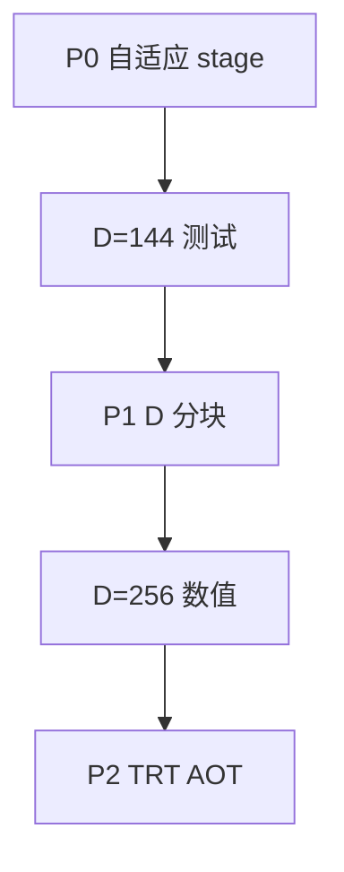

# FMHA 支持 D>128 修改方案

实现仓库：`study_cute/fmha/fmha.py`（实验主线）。问题与复现见 [d_256.md](d_256.md)。

**现象**：D≤128 同参数可跑；D=144 起 `CUDA_ERROR_INVALID_VALUE`（launch 阶段，多为动态 SMEM 超限）；D>128 另受 TMEM 列布局限制。

---

## 目标

| 阶段 | 目标 D | 状态 |
|------|--------|------|
| **P0** | SMEM 估算 + 禁止减 `q_stage` | ✅ 已实施（**不能**单独支持 D=144） |
| **P1** | 129–256+（`D_chunk=128`） | ✅ 已实施（待 Blackwell GPU 数值验证） |
| **P2** | TRT AOT + runner | 待做 |

---

## 阶段 P0：Host 校验（已实施，**不**支持 D>128 跑通）

### 实验结论（D=144）

| 现象 | 原因 |
|------|------|
| `q=1` 时 compile 后**卡死** | `q_stage=1` 与双 Q tile 流水线死锁 |
| `q=2,kv=3,epi=1` 后 **ILLEGAL_ADDRESS** | **TMEM**：`tmem_o0=256`、`tmem_o1=384` 间距仅 **128 列**，PV 的 O 宽 = **D=144** → O0 占 256..399，与 O1@384 **重叠**；且 256+2×144>512 |
| 减 `epi_stage` **不能**修 TMEM | 根因是 **D 维列数**，不是 epilogue stage |

**结论：P0 不能替代 P1。`D>128` 必须在 compile 前拒绝，或实现 D 分块。**

### 代码（`validate_config_host`）

- staged SMEM 按 `D_chunk=128` 估算（与 D=128 相同），预算 `227KB`
- `num_d_chunks > 1` 时打印 D-chunk 信息
- Pipeline stage **保持默认** `q=2, kv=3, epi=2`（不再对 D>128 减 stage）

### 验证

```bash
# 回归
python3 fmha/fmha.py --q_shape 1,968,8,128 --k_shape 1,968,1,128

# P1：D=144 / D=256（需 SM100+ 与 CUTE_DSL_ARCH）
python3 fmha/fmha.py --q_shape 1,968,8,144 --k_shape 1,968,1,144
python3 fmha/fmha.py --q_shape 1,968,8,256 --k_shape 1,968,1,256
```

---

## 阶段 P1：D 方向分块（`D_chunk=128`）— 已实施

实现文件：`study_cute/fmha/fmha.py`。

### P1 挂死修复（D=256 pipeline 死锁）

**根因（最终确认）**：

1. **`load_mma_sync_barrier` 误用**：persistent 下 Load 已 `advance` 到下一 tile，MMA 仍在上一 tile `arrive_and_wait` → 永久挂死。已**全部删除**；上游从不使用此 barrier。
2. **Q pipeline 被撑爆（主因之一）**：旧实现在**每个 KV step × 每个 d_chunk** 都 `acquire` Q0/Q1。`q_stage=2` 只能容纳 2 个 Q buffer，968/128≈8 步时单 tile 约 **32 次 Q acquire** → 必然死锁。
3. **正确模式（与上游 Blackwell fmha 一致）**：
   - **每个 D-chunk**：Q0/Q1 只加载 **一次**，贯穿该 chunk 的**整段 KV 扫描**
   - **每个 KV step**：只加载当前 chunk 的 K、V
   - **外层 `for d_chunk_idx`**：chunk0 扫完全部 KV 累加 S，再 chunk1 扫完全部 KV

**修复（当前实现）**：
- Load/MMA 均改为「**per d_chunk 整遍 KV** + Q 只 load/wait 一次」
- MMA 主循环恢复上游 **GEMM_QK0i → PV1 → GEMM_QK1i → PV0i → PV1(i_end)** 顺序
- `q0/q1.release()` 放在每个 d_chunk 的 KV 循环结束后（与上游一致）

- Host：`D_CHUNK=128`，`mma_tiler` 第三维恒为 128，`actual_head_dim` 为真实 D，`num_d_chunks=ceil(D/128)`。
- Load/MMA/Correction/Epilogue：对 `d_chunk_idx` 循环；QK 跨 chunk 累加 S；PV 跨 chunk 累加 O（`ACCUMULATE` 含 `d_chunk_idx != 0`）；Epilogue 写 `gO[..., d_chunk_idx, ...]`。
- `inv_sqrt_head_dim` 仍用完整 `head_dim`。

### 核心

- **MMA / SMEM / TMEM 的 K 维恒为 128**（与现网 D=128 布局一致）。
- **`num_d_chunks = ceil(head_dim / 128)`**；host `mma_tiler = (128, 128, 128)`。
- **QK**：对每个 KV tile，遍历 `d_chunk`，UMMA 累加到同一 **S**（`ACCUMULATE`）。
- **Softmax**：所有 chunk 的 QK 完成后再做（算法不变）。
- **PV**：每 chunk 计算 `P @ V[:, chunk]`，epilogue 写 O 时 D 坐标 **+ chunk×128**。

### 需改区域

| 模块 | 改动 |
|------|------|
| `__init__` / host `run()` | `d_chunk`, `num_d_chunks`, `mma_tiler` 固定 K=128 |
| Load warp | TMA 源 D 维 `+ d_chunk * 128` |
| MMA warp | 外包 `d_chunk` 循环（QK 累加 S；PV 写 O 分块） |
| Epilogue | TMA store O 的 D offset |
| `__call_vit__` | 同逻辑（若 ViT 也要 D>128） |

### 资源

| D | chunks | SMEM | TMEM |
|---|--------|------|------|
| 256 | 2 | 同 D=128 | 现有 offset 可用 |
| 384 | 3 | 同 D=128 | 可用；主循环 ×3 |

**性能**：QK+PV 约 ×`num_d_chunks`，属预期 trade-off。

---

## 阶段 P2：产品集成（可选）

1. 同步 P1 到 `TensorRT-Edge-LLM/kernelSrcs/fmha_cutedsl_blackwell/fmha.py`。
2. `build_cutedsl.py` 增加 `fmha_d256` variant。
3. `CuteDslFMHARunner::canImplement` 增加 `headSize == 256`。
4. README / [fmha.md](fmha.md) 更新支持列表。

**短期替代**：Edge-LLM plugin 对 D=256 走 **FMHA_v2** cubin（`canImplement` 已含 256）。

---

## 不推荐方案

| 方案 | 原因 |
|------|------|
| 只改 `q_shape` 最后一维 | SMEM/TMEM 仍按 D 分配 |
| 只改 TMEM offset | D=144 仍 SMEM 超 |
| `mma_tiler_mn` 128→64 | softmax/correction/TMEM 均按 128 宽设计，改动面≈重写 |

---

## 实施顺序



---

## 相关文档

- [d_256.md](d_256.md) — 现象、根因、实验日志
- [fmha.md](fmha.md) — FMHA 架构与 warp 分工
