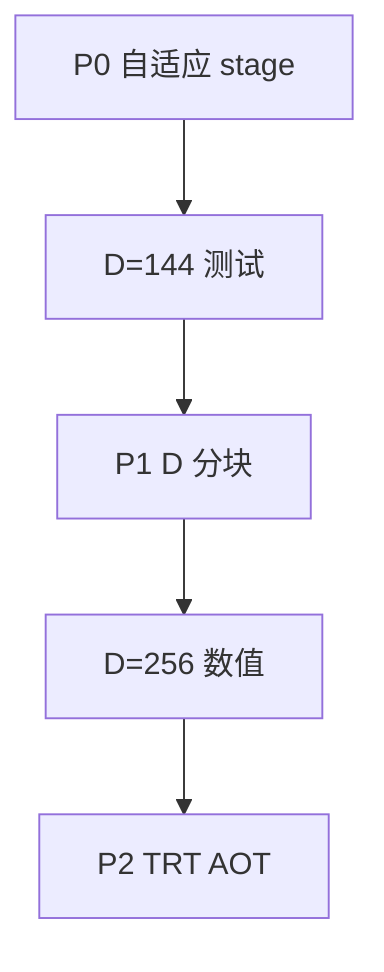

# FMHA 支持 D>128 修改方案

实现仓库：`study_cute/fmha/fmha.py`（实验主线）。问题与复现见 [d_256.md](d_256.md)。

**现象**：D≤128 同参数可跑；D=144 起 `CUDA_ERROR_INVALID_VALUE`（launch 阶段，多为动态 SMEM 超限）；D>128 另受 TMEM 列布局限制。

---

## 目标

| 阶段 | 目标 D | 状态 |
|------|--------|------|
| **P0** | ~129–180（含 **144**） | ✅ 已在 `study_cute/fmha/fmha.py` 实施 |
| **P1** | 192 / 256 / 更大 | 待做（D 分块） |
| **P2** | TRT AOT + runner | 待做（不改 Edge-LLM 直至 P1 稳定） |

---

## 阶段 P0：按 D 自适应 pipeline stage（已实施）

### 思路

固定 `q_stage=2, kv_stage=3, epi_stage=2` 时，动态 SMEM 粗算：

```text
bytes ≈ elem_size × (q_stage×cta_M×D + kv_stage×N_tile×D + epi_stage×128×D)
cta_M = 2×128 = 256, N_tile = 128
FP16: ≈ 2304 × D 字节（q=2,kv=3,epi=2）
FP16 减 stage (q=1,kv=2,epi=1): ≈ 1280 × D 字节
```

Blackwell 每 CTA 动态 SMEM 预算约 **220 KiB**（留 barrier/对齐余量）。

| D | 默认 stage 估算 | q=1,kv=2,epi=1 |
|---|----------------|----------------|
| 128 | ~224 KB | ~160 KB |
| 144 | ~252 KB ❌ | ~180 KB ✅ |
| 180 | ~315 KB ❌ | ~225 KB 临界 |
| 192 | ~336 KB ❌ | ~240 KB ❌ → 需 P1 |

### 代码改动（`BlackwellFusedMultiHeadAttentionForward`）

1. **`_pick_pipeline_stages(d_eff)`**  
   按 `qk_mma_tiler[2]`（padded D）选择 `q_stage / kv_stage / epi_stage`。

2. **`_setup_attributes()`**  
   调用 `_pick_pipeline_stages`，再设置 softmax prescale 等（行为不变）。

3. **`validate_config_host(q_dtype)`**  
   Host 在 `cute.compile` 前调用：估算 staged SMEM，超限则 `ValueError` 并指向本文 P1。

4. **`run()` / `run_llm_multi_round_prefill_test()`**  
   创建 `fmha` 后、`cute.compile` 前调用 `validate_config_host(in_dtype)`。

### 验证命令

```bash
cd study_cute
# 应通过（P0 减 stage）
python3 fmha/fmha.py --q_shape 1,968,8,144 --k_shape 1,968,1,144

# 回归
python3 fmha/fmha.py --q_shape 1,968,8,128 --k_shape 1,968,1,128

# 应 Host 明确报错（需 P1），而非 INVALID_VALUE
python3 fmha/fmha.py --q_shape 1,968,8,192 --k_shape 1,968,1,192
```

---

## 阶段 P1：D 方向分块（`D_chunk=128`）

### 核心

- **MMA / SMEM / TMEM 的 K 维恒为 128**（与现网 D=128 布局一致）。
- **`num_d_chunks = ceil(head_dim / 128)`**；host `mma_tiler = (128, 128, 128)`。
- **QK**：对每个 KV tile，遍历 `d_chunk`，UMMA 累加到同一 **S**（`ACCUMULATE`）。
- **Softmax**：所有 chunk 的 QK 完成后再做（算法不变）。
- **PV**：每 chunk 计算 `P @ V[:, chunk]`，epilogue 写 O 时 D 坐标 **+ chunk×128**。

### 需改区域

| 模块 | 改动 |
|------|------|
| `__init__` / host `run()` | `d_chunk`, `num_d_chunks`, `mma_tiler` 固定 K=128 |
| Load warp | TMA 源 D 维 `+ d_chunk * 128` |
| MMA warp | 外包 `d_chunk` 循环（QK 累加 S；PV 写 O 分块） |
| Epilogue | TMA store O 的 D offset |
| `__call_vit__` | 同逻辑（若 ViT 也要 D>128） |

### 资源

| D | chunks | SMEM | TMEM |
|---|--------|------|------|
| 256 | 2 | 同 D=128 | 现有 offset 可用 |
| 384 | 3 | 同 D=128 | 可用；主循环 ×3 |

**性能**：QK+PV 约 ×`num_d_chunks`，属预期 trade-off。

---

## 阶段 P2：产品集成（可选）

1. 同步 P1 到 `TensorRT-Edge-LLM/kernelSrcs/fmha_cutedsl_blackwell/fmha.py`。
2. `build_cutedsl.py` 增加 `fmha_d256` variant。
3. `CuteDslFMHARunner::canImplement` 增加 `headSize == 256`。
4. README / [fmha.md](fmha.md) 更新支持列表。

**短期替代**：Edge-LLM plugin 对 D=256 走 **FMHA_v2** cubin（`canImplement` 已含 256）。

---

## 不推荐方案

| 方案 | 原因 |
|------|------|
| 只改 `q_shape` 最后一维 | SMEM/TMEM 仍按 D 分配 |
| 只改 TMEM offset | D=144 仍 SMEM 超 |
| `mma_tiler_mn` 128→64 | softmax/correction/TMEM 均按 128 宽设计，改动面≈重写 |

---

## 实施顺序



---

## 相关文档

- [d_256.md](d_256.md) — 现象、根因、实验日志
- [fmha.md](fmha.md) — FMHA 架构与 warp 分工
